# HEARHELPER

## BCA FINAL YEAR PROJECT REPORT

### Bangalore University Style Draft

**Project Title:** HearHelper - An Assistive Communication and Accessibility Web Application for Hearing-Impaired Users  
**Course:** Bachelor of Computer Applications (BCA)  
**University:** Bangalore University  
**Academic Year:** 2025-2026  
**Submitted By:**  
- `[Student Name 1 / Ganesh] - [USN]`
- `[Student Name 2 / Puneeth] - [USN]`

**Under the Guidance of:** `[Guide Name]`  
**Department:** Department of Computer Applications  
**College:** `[College Name]`  
**Place:** Bengaluru

---

**Formatting Note**

This report draft is intentionally expanded for a `60+ page` submission when formatted in the usual BCA style with `Times New Roman`, `12 pt` body text, `1.5 line spacing`, justified alignment, A4 page size, and rendered diagrams. Institutional details such as certificate wording, signatures, margin specification, and final pagination should be adjusted according to the department-approved template before hard binding.

\newpage

# CERTIFICATE

This is to certify that the project report entitled **"HearHelper - An Assistive Communication and Accessibility Web Application for Hearing-Impaired Users"** is a bonafide work carried out by:

- `[Student Name 1 / Ganesh]`
- `[Student Name 2 / Puneeth]`

bearing USN numbers `[USN 1]` and `[USN 2]`, in partial fulfillment of the requirements for the award of the degree of **Bachelor of Computer Applications** of **Bangalore University**, during the academic year `2025-2026`, under my guidance and supervision.

| Guide Signature | Head of Department | Principal |
|---|---|---|
| `[Guide Name]` | `[HOD Name]` | `[Principal Name]` |

Place: `[College / Bengaluru]`  
Date: `[To be filled]`

\newpage

# DECLARATION

We hereby declare that the project report entitled **"HearHelper - An Assistive Communication and Accessibility Web Application for Hearing-Impaired Users"** is the original work carried out by us under the guidance of `[Guide Name]`, Department of Computer Applications, `[College Name]`, Bengaluru.

We further declare that:

1. This report is prepared by us as part of the BCA final year project work.
2. The work presented in this report has not been submitted either in part or in full to any other university or institution for the award of any degree or diploma.
3. The facts, diagrams, analysis, and implementation details described here are based on the current version of the project repository and not on the earlier outdated report draft.
4. All external technologies and technical references used in the project have been acknowledged in the reference section.

\newpage

# ACKNOWLEDGEMENT

We express our sincere gratitude to our project guide, **`[Guide Name]`**, for constant guidance, encouragement, and valuable suggestions throughout the development of this project. The guidance received during problem definition, design, implementation, and report preparation helped us complete this work in a disciplined and meaningful manner.

We thank the **Head of the Department**, **`[HOD Name]`**, the **Principal**, **`[Principal Name]`**, and the management of **`[College Name]`** for providing academic support, infrastructure, and encouragement. We also thank our faculty members, friends, classmates, and all those who shared suggestions and usability feedback during the testing of the application.

We gratefully acknowledge the creators and maintainers of the technologies used in the project, including **Firebase**, **Web Speech API**, **MediaPipe**, **TensorFlow**, **Flask-SocketIO**, **JavaScript**, **HTML5**, and **CSS3**. These tools made it possible to build an integrated accessibility-oriented solution within the scope of a BCA final year project.

Finally, we dedicate this effort to the hearing-impaired community and to the larger idea of inclusive technology. HearHelper was developed not merely as a software submission but as a socially relevant system intended to make communication more accessible and more dignified.

\newpage

# ABSTRACT

Communication barriers remain a daily reality for many individuals with hearing impairment. Although modern assistive tools exist, they are often fragmented across different applications, each handling only one part of the communication problem. A user may need one tool for speech-to-text, another for chat, a different platform for sign language reference, and a separate source for disability-related support information. This fragmentation reduces convenience and weakens accessibility.

The project **HearHelper** addresses this issue by providing a browser-based assistive communication platform that combines multiple related features in a single system. The current project includes user authentication, a dashboard, live speech transcription, community chat, a benefits information portal, settings and personalization, feedback handling, an admin analytics page, and a sign-language assistance module. The sign-language area further extends into an experimental AI workflow through MediaPipe-based browser recognition and an optional Python backend using TensorFlow and Flask-SocketIO.

The system is implemented using **HTML5**, **CSS3**, **JavaScript**, **Firebase Authentication**, **Cloud Firestore**, **Firebase Hosting**, and browser-native speech APIs. User registration and shared cloud data are managed through Firebase. Speech recognition and text-to-speech are handled in the browser to reduce latency and server dependence. The sign-language extension demonstrates how gesture recognition can be integrated into a broader assistive platform rather than treated as a separate isolated experiment.

HearHelper is significant because it approaches accessibility as an integrated design problem. Instead of solving only transcription or only messaging, it combines multiple forms of communication support and personalization. The project is also academically valuable because it demonstrates modular system design, cloud integration, accessibility-aware UI development, and exploratory AI components within a realistic BCA project scope. The system is affordable, device-independent, extensible, and suitable for future enhancement into a more production-ready accessibility platform.

\newpage

# TABLE OF CONTENTS

1. Introduction  
2. Literature Survey and Domain Analysis  
3. Requirement Analysis  
4. System Analysis and Design  
5. Module Design and Implementation  
6. Testing, Results, and Discussion  
7. Project Planning, Deployment, and Maintenance  
8. Conclusion and Future Scope  
9. References  
10. Appendices  

> Update page numbers after final export to Word or PDF.

\newpage

# LIST OF FIGURES

1. Figure 3.1 - Stakeholder View of the System  
2. Figure 4.1 - System Context Diagram  
3. Figure 4.2 - Use Case Diagram  
4. Figure 4.3 - DFD Level 0  
5. Figure 4.4 - DFD Level 1  
6. Figure 4.5 - High-Level Architecture Diagram  
7. Figure 4.6 - Component Diagram  
8. Figure 4.7 - Deployment Diagram  
9. Figure 4.8 - Firestore ER Diagram  
10. Figure 4.9 - Login Sequence Diagram  
11. Figure 4.10 - Community Messaging Sequence Diagram  
12. Figure 4.11 - Sign Language Recognition Flow  
13. Figure 7.1 - Development Gantt Chart  

\newpage

# LIST OF TABLES

1. Table 2.1 - Comparison with Existing Systems  
2. Table 2.2 - Feasibility Analysis  
3. Table 3.1 - Functional Requirements  
4. Table 3.2 - Non-Functional Requirements  
5. Table 3.3 - Hardware and Software Requirements  
6. Table 3.4 - User Roles and Responsibilities  
7. Table 5.1 - Module-to-File Mapping  
8. Table 6.1 - Test Environment  
9. Table 6.2 - Functional Test Cases  
10. Table 6.3 - Usability and Accessibility Test Cases  
11. Table 6.4 - Defects Observed and Resolved  
12. Table 7.1 - Risk Register  
13. Table A.1 - Screen-Wise User Manual Summary  
14. Table B.1 - Firestore Collection Structure  

\newpage

# ABBREVIATIONS

| Abbreviation | Meaning |
|---|---|
| AI | Artificial Intelligence |
| API | Application Programming Interface |
| BCA | Bachelor of Computer Applications |
| CSS | Cascading Style Sheets |
| DFD | Data Flow Diagram |
| ER | Entity Relationship |
| HTML | HyperText Markup Language |
| JS | JavaScript |
| ML | Machine Learning |
| STT | Speech to Text |
| TTS | Text to Speech |
| UI | User Interface |
| UX | User Experience |
| WCAG | Web Content Accessibility Guidelines |

\newpage

# CHAPTER 1

# INTRODUCTION

## 1.1 Background of the Study

Communication is one of the most important foundations of human participation in society. Whether the setting is educational, professional, social, domestic, medical, or administrative, communication enables users to understand instructions, express needs, ask questions, share feelings, and collaborate with others. For users with hearing impairment, however, communication often becomes a barrier rather than a bridge. In many real-life situations, spoken language is assumed to be immediately accessible. When it is not, the individual must depend on lip reading, written notes, interpretation by another person, or separate assistive tools.

This challenge is not only technical but social. A delay in communication can become a delay in participation. A misunderstood conversation can become a missed opportunity. A lack of accessible tools can lead to frustration, dependence, and avoidable exclusion. Modern digital technology has improved assistive possibilities, but the ecosystem is still fragmented. One application may provide speech-to-text, another may support messaging, and another may be dedicated to sign language learning or video references. Users often move across different tools for tasks that belong naturally to the same communication process.

HearHelper was developed to address this fragmentation through an integrated assistive web platform. The current project brings together real-time transcription, user-to-user community messaging, settings personalization, informational support through a benefits portal, feedback and admin monitoring, and sign-language assistance. The sign-language module itself goes beyond a static dictionary approach by including webcam-driven interaction and experimental AI support through MediaPipe and a separate Python backend.

Because the system is browser-based, it reduces the need for dedicated installation and works across a range of common devices. Because it uses Firebase services, it avoids the complexity of building identity and storage mechanisms from scratch. Because it uses browser-native speech APIs, it makes certain real-time interactions faster and more practical. This combination makes HearHelper a suitable academic project that still addresses a meaningful real-world problem.

## 1.2 Need for the Project

The need for HearHelper comes from a combination of accessibility gaps and technology opportunity. The major needs identified are:

1. The need for real-time speech-to-text assistance in everyday conversations.
2. The need for a centralized communication support platform rather than multiple disconnected tools.
3. The need for accessible and personalized interfaces tailored to hearing-impaired users.
4. The need for low-cost browser-based solutions that do not require specialized proprietary hardware.
5. The need to extend communication support into sign-language assistance and educational guidance.
6. The need to combine utility features with informational support such as benefits awareness and community connection.

These needs are practical and immediate. In many situations, the communication challenge is not caused by the total absence of technology, but by the absence of integrated, user-friendly, and purpose-oriented technology. HearHelper attempts to solve that problem within the scope of a BCA final year project.

## 1.3 Problem Statement

People with hearing impairment often face difficulty in understanding spoken communication, participating in day-to-day interactions, accessing integrated support tools, and finding consolidated accessibility-related information. Existing digital tools usually handle isolated tasks such as transcription, chat, or sign learning, but do not provide a unified assistive environment. Therefore, there is a need for an integrated, accessible, and web-based system that supports communication, personalization, information access, and sign-language assistance in one platform.

## 1.4 Objectives of the Project

The major objectives of HearHelper are:

1. To design and develop a browser-based assistive communication application.
2. To implement live speech-to-text transcription using browser speech APIs.
3. To provide a community communication module for registered users.
4. To implement sign-language assistance using webcam-based interaction.
5. To provide categorized information about relevant benefits and support resources.
6. To offer user settings for display, audio, profile, and accessibility preferences.
7. To provide feedback collection and an admin monitoring interface.
8. To create a modular system that can be extended with advanced AI and stronger security in future versions.

## 1.5 Scope of the Project

The scope of the current project includes:

- registration and login,
- a post-login home dashboard,
- live transcription,
- community messaging,
- sign-language assistance,
- benefits information,
- settings and profile management,
- feedback handling,
- and admin analytics.

The scope does not include a full-scale native mobile app, offline-first operation, production-grade role-based security, or sign-language recognition for a complete vocabulary. The current system is intended as a functional academic project with strong practical relevance and clear future expansion paths.

## 1.6 Methodology Adopted

The project followed an incremental and modular development approach. The system was divided into independent units such as authentication, transcription, communication, benefits, settings, feedback, admin, and AI assistance. Each module was built and refined separately before integration. This approach reduced complexity, allowed repeated testing, and supported continuous improvement without blocking overall progress.

The sign-language component was treated as an extendable subsystem. A browser-side gesture recognition interface was first designed, and an optional Python backend for model-based prediction was then added as an experimental enhancement. This demonstrates a practical understanding of how core features and experimental features can coexist in a project repository.

## 1.7 Significance of the Project

HearHelper is significant because it combines technical learning with social relevance. It is not a purely theoretical software exercise; it addresses a real problem experienced by a real user group. It also demonstrates the value of accessible design, modular programming, cloud integration, and AI experimentation within the BCA curriculum. The project shows that a web application can do more than display information; it can actively support inclusive communication.

\newpage

## 1.8 Chapter Scheme

The remaining chapters of this report are organized as follows:

- Chapter 2 presents the literature survey, domain analysis, and feasibility study.
- Chapter 3 presents the functional and non-functional requirements of the current system.
- Chapter 4 explains the system analysis and design using diagrams and data models.
- Chapter 5 explains the implementation of the project modules with reference to the current source structure.
- Chapter 6 presents testing, outcomes, limitations, and discussion.
- Chapter 7 covers planning, deployment, and maintenance considerations.
- Chapter 8 concludes the report and presents future scope.
- The final sections include references and appendices.

\newpage

# CHAPTER 2

# LITERATURE SURVEY AND DOMAIN ANALYSIS

## 2.1 Introduction

Before building HearHelper, it was necessary to study the broader domain of assistive communication systems. A good project in this area cannot be designed only from a programming point of view. It must also consider accessibility, communication behavior, user trust, clarity of interaction, and practical deployment constraints. The literature and domain analysis therefore focused on three major themes: existing assistive applications, communication workflows of hearing-impaired users, and the role of cloud and AI technologies in accessibility-oriented web systems.

## 2.2 Existing Systems

The broad categories of existing systems relevant to this project are summarized below.

### 2.2.1 Speech-to-Text Tools

Speech-to-text applications convert spoken language into readable text. These tools are highly useful in classrooms, offices, healthcare environments, and family conversations. Their strengths include immediate transcription, low input effort, and usefulness in noisy or formal situations. However, they usually focus only on converting audio into text and do not provide integrated settings, community interaction, disability-specific information, or sign-language support.

### 2.2.2 Messaging Platforms

Messaging applications enable text-based communication and can reduce the burden of spoken interaction. However, they are generally designed for all users rather than specifically for accessibility. They may not provide quick phrase support, hearing-oriented UI simplification, font scaling, or integrated speech workflows. As a result, they do not fully solve accessibility-specific communication barriers.

### 2.2.3 Sign Language Learning Platforms

Sign language platforms are useful for education, awareness, and practice. They often include video lessons, alphabet charts, examples of signs, and beginner-friendly references. Their limitation is that they are usually educational tools rather than integrated daily communication platforms. They do not necessarily connect with chat, transcription, user accounts, or live communication assistance.

### 2.2.4 Information Portals for Disability Support

Government and public-service portals publish information about schemes, concessions, scholarships, and pensions for persons with disabilities. Such information is important but often distributed across multiple sources and presented in a generic administrative format rather than an accessibility-centered interface. Users may know that help exists but still struggle to locate relevant material efficiently.

### 2.2.5 Gesture Recognition Research Systems

Recent academic and prototype systems using MediaPipe, landmark extraction, TensorFlow, LSTM models, and webcam pipelines have shown that gesture-based recognition is feasible even on commodity devices. However, many such systems remain isolated demonstrations. They may recognize gestures accurately in controlled settings but are not integrated into broader assistive user platforms.

## 2.3 Comparative Analysis

| Feature | STT Tools | Messaging Apps | Sign Learning Sites | Benefits Portals | HearHelper |
|---|---|---|---|---|---|
| Live speech transcription | Yes | No | No | No | Yes |
| User-to-user chat | Rare | Yes | No | No | Yes |
| Hearing-focused settings | Limited | Limited | Limited | No | Yes |
| Sign-language interaction | No | No | Partial | No | Yes |
| Benefits awareness | No | No | No | Yes | Yes |
| Unified browser workflow | Rare | Partial | Partial | Yes | Yes |
| Admin insights | No | Limited | No | No | Yes |

**Table 2.1 - Comparison with Existing Systems**

The comparison shows that current systems are usually strong in one dimension and weak in integration. HearHelper was therefore conceived as a unified accessibility workflow rather than a single-feature application.

## 2.4 Limitations of Existing Systems

The domain study revealed the following common limitations:

1. Most tools are fragmented and solve only one part of the communication problem.
2. Accessibility settings are often minimal.
3. Sign-language support is usually separated from daily-use communication tools.
4. Community interaction and informational support are rarely bundled with accessibility functions.
5. Advanced AI experiments are often not usable by ordinary end users because they lack a polished front end.

These observations directly influenced the structure of HearHelper.

## 2.5 Research Gap

The gap identified in the domain is the lack of a lightweight, browser-accessible, integrated platform that combines live transcription, communication, profile personalization, benefits guidance, admin monitoring, and experimental sign-language interaction. HearHelper attempts to fill that gap within the academic scope of a BCA project by balancing practical usability with extendable design.

## 2.6 Proposed System

The proposed system is a web-based platform for hearing-impaired communication support. It is not limited to one use case. Instead, it supports a set of related workflows:

- understanding speech through live transcription,
- staying connected through community messaging,
- accessing benefits and support information,
- customizing accessibility settings,
- obtaining sign-language guidance,
- and allowing admins to view user and feedback data.

The project uses a hybrid model. Essential user-facing functionality is provided through the browser and Firebase. Experimental AI-based sign-language prediction is supported through MediaPipe and an optional Python backend. This separation allows the core platform to remain usable even if the advanced AI backend is not running.

## 2.7 Feasibility Study

The feasibility of HearHelper was evaluated from technical, economic, operational, schedule, and ethical perspectives.

| Feasibility Type | Observation | Conclusion |
|---|---|---|
| Technical | Technologies such as HTML, CSS, JS, Firebase, and MediaPipe are accessible and well documented. | Feasible |
| Economic | Development tools are free or low cost and suitable for student projects. | Feasible |
| Operational | Users can interact through familiar browser-based interfaces. | Feasible |
| Schedule | Modular development supports completion within an academic timeline. | Feasible |
| Ethical / Legal | Accessibility goal is socially valuable, but production security and privacy rules require future strengthening. | Feasible with caution |

**Table 2.2 - Feasibility Analysis**

### 2.7.1 Technical Feasibility

The system is technically feasible because its major parts are supported by mature technologies. Firebase reduces backend management effort. Browser APIs reduce server-side workload for speech processing. MediaPipe provides ready-to-use gesture recognition infrastructure. Python-based ML tools are suitable for experimental training and inference.

### 2.7.2 Economic Feasibility

The project is economically feasible because it relies on open technologies and common devices. No expensive hardware is required for the base system. Even the sign-language module can run on an ordinary webcam.

### 2.7.3 Operational Feasibility

The project is operationally feasible because it provides interface-level simplicity. The user can navigate through cards, forms, buttons, and chat panels that follow recognizable interaction patterns. The application can be used by students, families, and general users without specialized technical training.

### 2.7.4 Schedule Feasibility

The modular structure allows teams to implement and test one feature set at a time. This is especially valuable in an academic project where some modules may stabilize earlier than others.

## 2.8 Software Process Model

An incremental prototyping model best describes the development of HearHelper. A basic web application skeleton was created first. Core modules such as login, home navigation, and transcription were built early. Additional modules such as community, benefits, settings, feedback, admin, and sign-language support were integrated progressively. This approach made the project manageable and encouraged continuous refinement.

## 2.9 Domain Relevance

The domain of assistive communication places strong emphasis on usability, trust, clarity, responsiveness, and practical usefulness. In many business applications, minor UI inconvenience may only reduce efficiency. In accessibility software, the same inconvenience can become a barrier. For that reason, the project gives importance not only to algorithms and storage but also to visible controls, readable text, status indicators, history panels, and simple navigation.

## 2.10 Summary of the Chapter

This chapter established that existing tools are fragmented and that there is strong value in a unified accessibility-centered communication platform. It also showed that the project is technically, economically, and operationally feasible within a BCA academic setting.

\newpage

# CHAPTER 3

# REQUIREMENT ANALYSIS

## 3.1 Introduction

Requirement analysis defines the behavior, quality attributes, constraints, and scope of the system. Since HearHelper integrates communication, personalization, cloud data, and AI assistance, requirement analysis was essential for keeping the system organized and academically defensible.

## 3.2 Stakeholders

The key stakeholders of the current system are:

1. Hearing-impaired users.
2. General users communicating with hearing-impaired users.
3. Administrators who review user and feedback information.
4. Developers and maintainers.
5. Faculty evaluators reviewing the project academically.

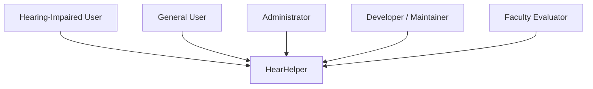

**Figure 3.1 - Stakeholder View of the System**

## 3.3 Functional Requirements

| ID | Requirement | Description |
|---|---|---|
| FR1 | Registration | The system shall allow users to create accounts using email and password. |
| FR2 | Login | The system shall authenticate registered users through Firebase Authentication. |
| FR3 | Home Dashboard | The system shall provide a central dashboard after successful login. |
| FR4 | Live Transcription | The system shall convert speech to text in real time. |
| FR5 | Transcript Management | The system shall support transcript history, clear, copy, download, and speech playback. |
| FR6 | Community Chat | The system shall allow registered users to exchange messages. |
| FR7 | Quick Phrase Support | The system shall provide quick accessibility-friendly phrases in chat. |
| FR8 | Sign Language Assistance | The system shall provide webcam-based sign support and sentence formation. |
| FR9 | Benefits Portal | The system shall display categorized support information. |
| FR10 | Settings | The system shall allow display, audio, language, and profile customization. |
| FR11 | Feedback | The system shall collect feedback from users. |
| FR12 | Admin Dashboard | The system shall allow an authorized admin to review users and feedback. |

**Table 3.1 - Functional Requirements**

## 3.4 Non-Functional Requirements

| ID | Requirement | Description |
|---|---|---|
| NFR1 | Usability | The system should remain easy to use and visually understandable. |
| NFR2 | Accessibility | Controls, font sizes, and workflow should be friendly for accessibility needs. |
| NFR3 | Responsiveness | The UI should adapt to multiple screen sizes. |
| NFR4 | Performance | User actions such as chat and transcription should feel responsive. |
| NFR5 | Reliability | Core workflows should operate predictably in normal browser conditions. |
| NFR6 | Maintainability | Source code should remain modular and page-oriented. |
| NFR7 | Scalability | Cloud-backed modules should support additional users and data. |
| NFR8 | Portability | The solution should run on standard browsers. |
| NFR9 | Extensibility | The system should support future AI and security enhancements. |

**Table 3.2 - Non-Functional Requirements**

## 3.5 User Roles

| Role | Description | Privileges |
|---|---|---|
| Visitor | Unauthenticated user | Access public landing and auth pages |
| User | Registered and logged-in user | Access dashboard, transcription, community, benefits, settings, sign-language module |
| Admin | Authorized user with admin session | Access admin dashboard, user list, feedback list, analytics |

**Table 3.4 - User Roles and Responsibilities**

## 3.6 Hardware and Software Requirements

| Category | Requirement |
|---|---|
| Processor | Dual-core or above |
| RAM | 4 GB or above recommended |
| Browser | Modern Chrome, Edge, Firefox, or equivalent |
| Internet | Required for Firebase and external dependencies |
| Optional Devices | Microphone, webcam, speakers/headphones |
| Front End | HTML5, CSS3, JavaScript |
| Cloud Stack | Firebase Authentication, Cloud Firestore, Firebase Hosting |
| AI Stack | MediaPipe, Python, TensorFlow, Flask-SocketIO |

**Table 3.3 - Hardware and Software Requirements**

## 3.7 Input Requirements

The system accepts several forms of input:

- text input for login, registration, chat, and feedback,
- audio input for transcription,
- webcam video input for sign-language assistance,
- setting values for preferences,
- and selection-based input for benefits categories and profile choices.

## 3.8 Output Requirements

The major system outputs are:

- transcribed text,
- synthesized speech,
- message history,
- benefits content,
- profile and settings values,
- admin tables and charts,
- and gesture recognition output.

## 3.9 Data Requirements

The current repository uses the following main data structures:

- `users` collection in Firestore,
- `messages` collection in Firestore,
- `feedback` collection in Firestore,
- local storage for settings and light profile history,
- local storage for transcript and gesture history in some modules.

## 3.10 Constraints and Assumptions

The following constraints affect the current project:

1. Browser speech APIs depend on browser support and permission access.
2. Sign-language recognition is limited to a small set of gestures in the current experimental model.
3. Internet access is needed for cloud-backed features.
4. Firestore rules are presently permissive for project demonstration and should be tightened later.
5. Admin access is role-limited but can be further improved through stronger claim-based authorization.

Assumptions include the availability of a modern browser, correct Firebase configuration, and access to microphone or webcam where needed.

## 3.11 Summary of the Chapter

This chapter defined the functional scope and quality requirements of HearHelper. These requirements directly inform the system design described in the next chapter.

\newpage

# CHAPTER 4

# SYSTEM ANALYSIS AND DESIGN

## 4.1 Introduction

This chapter describes how HearHelper is designed as a modular web platform. The design balances user-facing simplicity with technical flexibility. It also separates essential functionality from optional experimental components so that the core system remains usable even when the AI backend is not active.

## 4.2 System Context Diagram

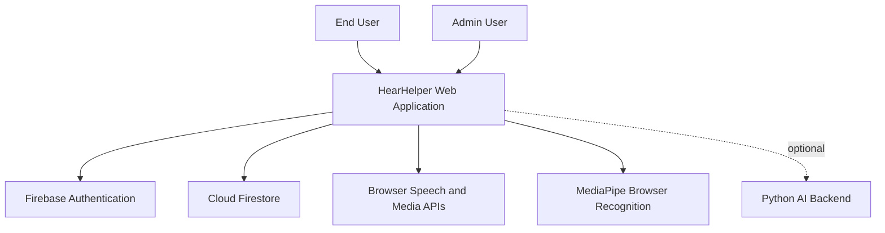

**Figure 4.1 - System Context Diagram**

## 4.3 Use Case Diagram

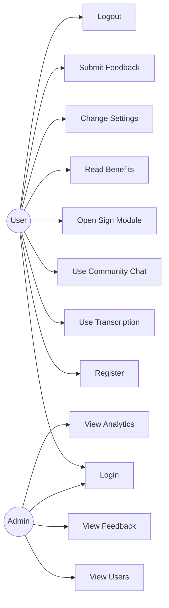

**Figure 4.2 - Use Case Diagram**

## 4.4 DFD Level 0

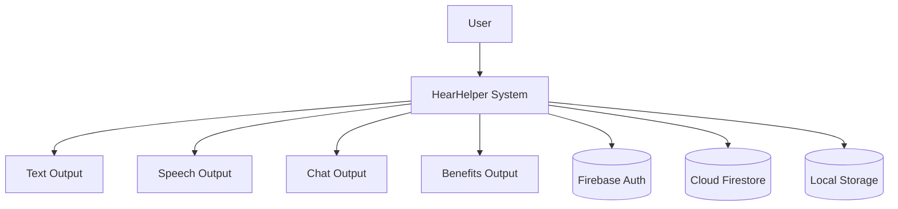

**Figure 4.3 - DFD Level 0**

## 4.5 DFD Level 1

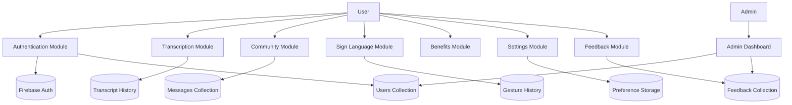

**Figure 4.4 - DFD Level 1**

## 4.6 High-Level Architecture

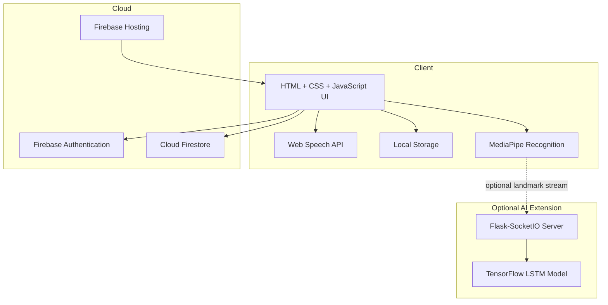

**Figure 4.5 - High-Level Architecture Diagram**

## 4.7 Component Diagram

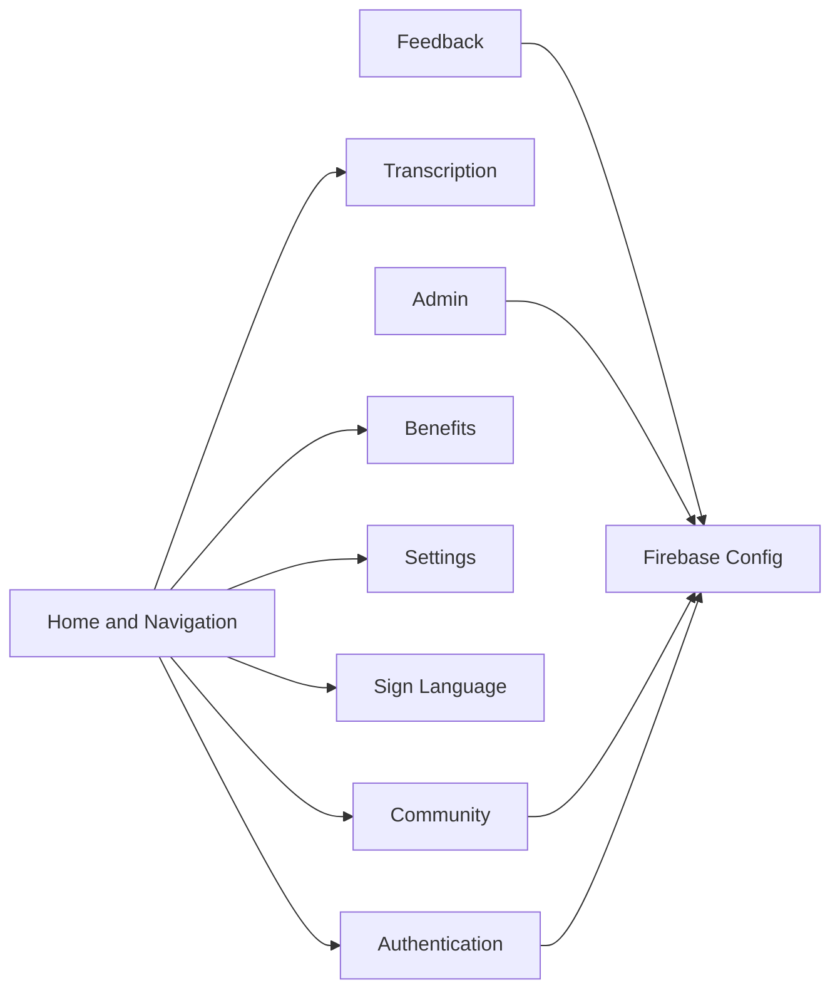

**Figure 4.6 - Component Diagram**

## 4.8 Deployment Diagram

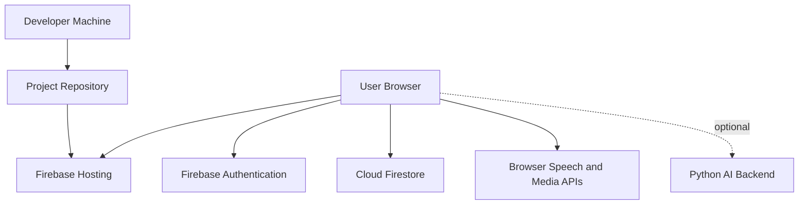

**Figure 4.7 - Deployment Diagram**

## 4.9 Firestore Data Model

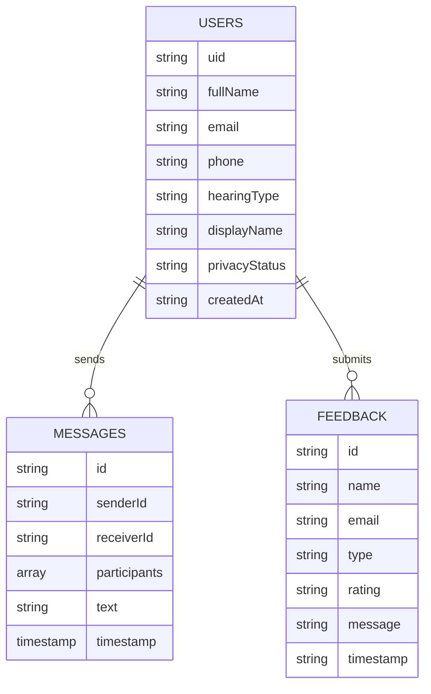

**Figure 4.8 - Firestore ER Diagram**

## 4.10 Security Design

The project uses Firebase Authentication for user identity, which is a strong architectural decision for a student system. However, the present Firestore rules are intentionally open in the repository to simplify project demonstration. From a design perspective, this means the current system is suitable for academic usage but would need stronger authorization rules for production deployment.

Future improvements in the security design should include:

1. role-based access control for admin functions,
2. per-user read/write restrictions,
3. restricted access to chat documents,
4. server-side validation for sensitive updates,
5. and stronger data auditing.

## 4.11 Sequence Diagram - Login

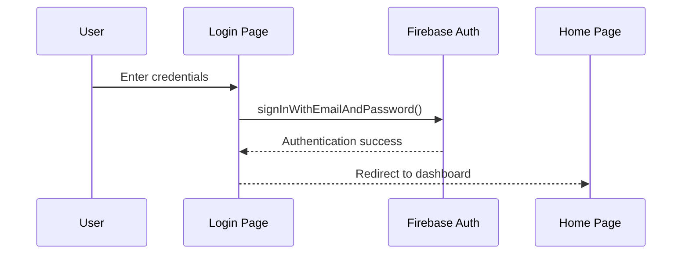

**Figure 4.9 - Login Sequence Diagram**

## 4.12 Sequence Diagram - Community Messaging

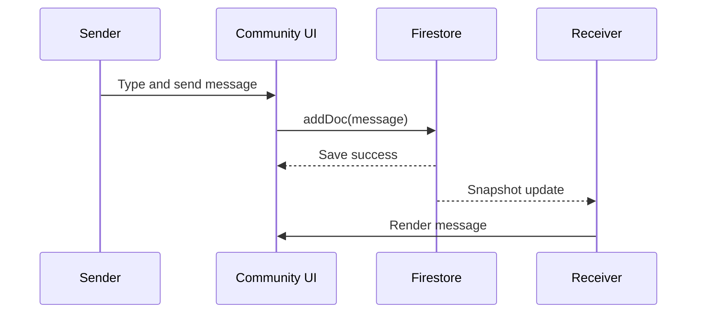

**Figure 4.10 - Community Messaging Sequence Diagram**

## 4.13 Sequence Diagram - Sign Language Recognition

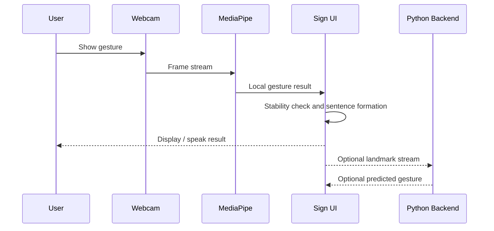

**Figure 4.11 - Sign Language Recognition Flow**

## 4.14 Design Strengths

The design of HearHelper has several strengths:

1. It keeps the deployed system lightweight.
2. It uses cloud services only where shared state is required.
3. It allows progressive enhancement through optional AI backends.
4. It separates modules for maintainability.
5. It remains understandable for academic evaluation and future modification.

## 4.15 Summary of the Chapter

This chapter transformed requirements into system structure through diagrams and design explanations. It explained how the current project uses browser APIs, Firebase services, local storage, and optional AI extensions in a modular arrangement.

\newpage

\newpage

# CHAPTER 5

# MODULE DESIGN AND IMPLEMENTATION

## 5.1 Introduction

This chapter explains how the current HearHelper project is implemented in the repository. The report is based on the current source code and reflects the actual modular arrangement of the project after recent changes. The application primarily resides under the `public` directory and is supported by additional AI prototype folders inside `AI Project`.

The implementation strategy is intentionally modular. Each major page has its own HTML file, often a dedicated CSS file, and a JavaScript file focused on page-specific behavior. Shared concerns such as authentication, Firebase configuration, navigation, and lightweight storage are separated into reusable scripts.

## 5.2 Module-to-File Mapping

| Module | Main Files |
|---|---|
| Home / Dashboard | `public/home.html`, `public/css/index.css`, `public/js/navigation.js`, `public/js/app.js` |
| Authentication | `public/pages/login.html`, `public/pages/register.html`, `public/pages/forgot-password.html`, `public/js/login.js`, `public/js/register.js`, `public/js/forgot-password.js`, `public/js/auth.js` |
| Live Transcription | `public/pages/transcription.html`, `public/css/transcription.css`, `public/js/speech.js`, inline page logic |
| Community Chat | `public/pages/community.html`, `public/css/community_connect.css`, `public/js/community_connect.js` |
| Benefits Portal | `public/pages/benefits.html`, `public/css/benefits.css`, `public/js/benefits.js` |
| Settings | `public/pages/settings.html`, `public/css/settings.css`, `public/js/storage.js` |
| Sign Language | `public/pages/sign_language.html`, `public/css/sign_language.css`, `public/js/sign_language_ai.js` |
| Feedback | `public/js/app.js`, Firestore feedback collection |
| Admin Dashboard | `public/pages/admin.html`, `public/css/admin.css`, `public/js/admin.js` |
| Firebase Layer | `public/js/firebase-config.js`, `firebase.json`, `firestore.rules` |
| AI Prototype Backend | `AI Project/Python_Backend/app.py`, `train_model.py`, `collect_data.py` |

**Table 5.1 - Module-to-File Mapping**

## 5.3 Home and Navigation Module

The home page acts as the central dashboard of the system. It presents HearHelper as an integrated accessibility platform and exposes the major modules through cards and clear call-to-action buttons. The home page is implemented in `public/home.html` and styled through `index.css`, `responsive.css`, and related CSS files.

The dashboard serves multiple purposes:

1. It gives the user a clear overview of available features.
2. It acts as a post-login entry point for the application.
3. It exposes feature cards that make navigation easier for users who may prefer simple direct movement between modules.
4. It includes a help and feedback system that improves support and project completeness.

The navigation logic is handled by `public/js/navigation.js`, which manages mobile menu toggling, active link updates, and simple page transitions. This shared navigation script helps preserve consistency across the major pages.

## 5.4 Authentication Module

The authentication module is one of the most important parts of the current system because most application features are intended for registered users. The project uses **Firebase Authentication** rather than a custom password storage model. This improves reliability, reduces implementation risk, and aligns the project with modern identity management practices.

### 5.4.1 Registration

The registration workflow is implemented through:

- `public/pages/register.html`
- `public/js/register.js`

The registration form collects:

- full name,
- email,
- phone,
- hearing impairment type,
- password,
- password confirmation,
- and agreement to terms.

The registration script validates password length, password confirmation, and user consent before calling `createUserWithEmailAndPassword()`. After authentication succeeds, the script stores additional profile information in the Firestore `users` collection using the Firebase UID as the document key.

This design is academically meaningful because it separates identity from application profile data in a clean and scalable way.

### 5.4.2 Login

The login workflow is handled through:

- `public/pages/login.html`
- `public/js/login.js`

The login module supports both user access and authorized admin access. During the recent cleanup of the project, the insecure hardcoded admin password flow was replaced with a Firebase-backed admin login model restricted through an allowed admin email check and an admin session flag. This makes the current project more consistent with sound software design practice.

### 5.4.3 Forgot Password

The forgot password flow is implemented through:

- `public/pages/forgot-password.html`
- `public/js/forgot-password.js`

The system verifies whether the email exists in Firebase sign-in methods and then sends a password reset email. This improves user recovery without needing custom mail logic for authentication.

### 5.4.4 Route Protection and Logout

The shared `public/js/auth.js` file listens to authentication state changes through `onAuthStateChanged`. It updates page access, controls redirection, adjusts the navigation bar for logged-in users, and exposes a common `logoutUser()` function for safe logout behavior across pages. This module is crucial because it maintains session-aware navigation throughout the application.

## 5.5 Live Transcription Module

The live transcription feature is one of the most visible assistive capabilities in the current project. It is implemented in:

- `public/pages/transcription.html`
- `public/css/transcription.css`
- `public/js/speech.js`

The page also contains inline logic for recognition state handling, history management, clipboard copying, downloading, and speech playback of transcript output.

### 5.5.1 Working Principle

The transcription module uses `window.SpeechRecognition` or `window.webkitSpeechRecognition` depending on browser support. When the user starts listening:

1. the browser begins capturing microphone input,
2. recognition results are processed continuously,
3. interim text is shown separately,
4. final transcribed text is appended to the output,
5. the user can copy, download, clear, or speak the result.

This module illustrates how browser APIs can provide real-time assistive utility without building a dedicated speech backend.

### 5.5.2 Design Considerations

The page uses:

- a language selector,
- a status badge,
- separate final and interim transcript areas,
- transcription history,
- and utility buttons for clear, copy, download, and speech playback.

These interface choices are important because the goal of assistive software is not only to generate output, but to make that output usable and manageable in context.

## 5.6 Community Connect Module

The community module is implemented through:

- `public/pages/community.html`
- `public/css/community_connect.css`
- `public/js/community_connect.js`

This module provides user-to-user chat for registered users. It adds a social communication layer to HearHelper and distinguishes the project from a purely one-way assistive utility.

### 5.6.1 Data Model

The chat system uses the Firestore `messages` collection. Each message stores:

- message text,
- sender ID,
- receiver ID,
- participant list,
- and server timestamp.

The participant array is useful because it allows easy querying for all chats involving the current user.

### 5.6.2 Features

The current community page includes:

- contact list loading from `users`,
- search filtering,
- real-time message updates through `onSnapshot`,
- active contact selection,
- quick phrase buttons,
- profile modal for display name and status,
- and basic message sending via Firestore.

The quick phrase feature is especially appropriate for the project domain because it reduces typing effort and supports fast communication in common situations.

### 5.6.3 Implementation Note

The script avoids a more complex Firestore indexing approach by performing some sorting locally after retrieving relevant messages. This is a practical student-project choice that keeps configuration simpler while still delivering the required functionality.

## 5.7 Benefits Information Module

The benefits module is implemented in:

- `public/pages/benefits.html`
- `public/css/benefits.css`
- `public/js/benefits.js`

This module is important because accessibility is not only about direct communication tools. Many users also need awareness of available support schemes, concessions, scholarships, and government programs. The project therefore includes a structured information module focused on benefits relevant to hearing-impaired users in India.

### 5.7.1 Current Content Design

The benefits page contains categorized static information cards. These cover areas such as:

- central government benefits,
- state or regional support,
- student-oriented benefits,
- employee-oriented benefits,
- and homemaker or household-oriented support categories.

### 5.7.2 Filtering Logic

The filtering behavior is handled by `benefits.js`. During the recent cleanup of the project, the filtering logic was corrected so that it no longer depends on an invalid raw `event` object during initial page load. The improved implementation supports proper button activation and initial rendering.

### 5.7.3 Relevance

This module adds strong social value to the project because it connects immediate communication support with longer-term informational empowerment.

## 5.8 Settings and Personalization Module

The settings module is implemented in:

- `public/pages/settings.html`
- `public/css/settings.css`
- `public/js/storage.js`

The settings page is significant because accessibility is not a one-size-fits-all problem. Different users may prefer larger text, different speech rates, different voices, or updated profile information.

### 5.8.1 Features

The settings module supports:

- font size customization,
- speech volume adjustment,
- speech rate and pitch control,
- voice selection,
- speech recognition language selection,
- full name, email, phone, and hearing-status profile values,
- reset to defaults,
- and save-all changes.

### 5.8.2 Local Storage Design

The `storage.js` file acts as a lightweight client-side persistence layer. It stores:

- user settings,
- profile values,
- and related local data.

This is an appropriate design choice for personalization data that does not always require cloud-level persistence.

## 5.9 Sign Language Assistance Module

The sign-language module is one of the most distinctive parts of the project. It is implemented through:

- `public/pages/sign_language.html`
- `public/css/sign_language.css`
- `public/js/sign_language_ai.js`

This module combines educational and interactive functionality. It is not limited to showing reference material; it also attempts recognition through webcam input.

### 5.9.1 Browser-Side Recognition

The module uses `@mediapipe/tasks-vision` and dynamically loads a gesture recognizer model. The browser-side recognition pipeline:

1. opens the webcam,
2. reads frames,
3. identifies landmarks,
4. maps recognized gestures to phrases and emojis,
5. displays live output,
6. and uses a stability threshold before adding recognized words to a forming sentence.

This stability logic is especially useful because gesture recognition can produce repeated or noisy outputs if a sign is held for multiple frames.

### 5.9.2 Sentence Formation and TTS

The current sign module allows recognized phrases to be accumulated into a sentence. The user can:

- speak the sentence,
- save it to history,
- or clear it.

This transforms the module from a novelty demo into a small communication aid.

### 5.9.3 Optional Python AI Backend

The repository also contains:

- `AI Project/Python_Backend/app.py`
- `collect_data.py`
- `train_model.py`

The backend expects landmark coordinate sequences and uses an LSTM-based model trained on a small set of actions such as `Thanks`, `Mother`, `Looking`, `Yes`, `No`, and `Love`. The front-end sign module can stream flattened landmarks to the backend through Socket.IO when the backend is available. This design makes the AI extension optional rather than mandatory.

## 5.10 Feedback and Help Module

The project includes a help and feedback flow accessible from the main interface. The logic is handled mainly in `public/js/app.js`, which:

- manages help modal behavior,
- opens and closes feedback forms,
- submits feedback to Firestore,
- and displays notifications.

The feedback structure includes:

- name,
- email,
- type,
- rating,
- message,
- timestamp.

This module strengthens the project by supporting user response collection, which is useful both practically and academically.

## 5.11 Admin Dashboard Module

The admin module is implemented through:

- `public/pages/admin.html`
- `public/css/admin.css`
- `public/js/admin.js`

The admin dashboard reads Firestore data and displays:

- total users,
- active users,
- total feedback,
- open tickets,
- recent activity table placeholders,
- user management table,
- feedback table,
- analytics charts.

### 5.11.1 Current Behavior

The admin dashboard uses Firestore snapshot listeners to retrieve users and feedback collections. It then updates statistics and charts dynamically. During the recent cleanup, admin protection was improved so that the page checks authenticated admin status before allowing access.

### 5.11.2 Academic Value

This module increases the academic depth of the project because it demonstrates not only user-facing design but also basic monitoring, analytics, and administration.

## 5.12 Firebase Configuration and Hosting

The application uses Firebase for authentication, Firestore, and hosting. The relevant files are:

- `public/js/firebase-config.js`
- `firebase.json`
- `firestore.rules`

The Firebase configuration initializes:

- `initializeApp()`
- `getAuth()`
- `getFirestore()`

The hosting configuration points to the `public` directory, which is appropriate for a static web application. Firestore rules are currently open for demonstration, which should be mentioned honestly in the project report as a development convenience rather than a final production practice.

## 5.13 Optional Node.js Service Prototype

The repository includes `public/js/servers.js`, which contains an Express-based backend prototype. It includes API ideas for transcripts and other service endpoints. However, the current deployed flow of the project mainly depends on Firebase and browser APIs. For report clarity, this file should be treated as an auxiliary prototype component rather than a core deployed dependency.

## 5.14 Key Algorithms and Logical Flows

### 5.14.1 Speech Recognition Flow

1. Initialize recognition object.
2. Set language and continuous listening behavior.
3. Capture interim and final transcription.
4. Update UI state.
5. Store or export transcript based on user action.

### 5.14.2 Community Messaging Flow

1. Authenticate user.
2. Load other users from Firestore.
3. Select active contact.
4. Subscribe to real-time message updates.
5. Send text by creating a Firestore document.
6. Re-render ordered messages.

### 5.14.3 Gesture Stability Flow

1. Capture webcam frame.
2. Detect gesture result.
3. Compare with current active gesture.
4. Increment stability counter if repeated.
5. Add phrase only after threshold.
6. Prevent immediate duplicate word insertion.

### 5.14.4 Admin Analytics Flow

1. Attach snapshot listeners to `users` and `feedback`.
2. Transform raw collection data into tables and counts.
3. Group values for chart visualization.
4. Re-render analytics when cloud data changes.

## 5.15 Summary of the Chapter

This chapter explained how each current module of HearHelper is implemented in the repository. The implementation reflects a practical blend of front-end development, Firebase integration, browser-native accessibility features, and exploratory AI components.

\newpage

\newpage

# CHAPTER 6

# TESTING, RESULTS, AND DISCUSSION

## 6.1 Introduction

Testing is essential for validating whether a software system behaves according to its requirements. For HearHelper, testing was particularly important because the project combines UI behavior, authentication, cloud data, real-time messaging, browser speech services, accessibility settings, and experimental sign-language recognition. Different modules depend on different runtime conditions, so the testing strategy had to include both logic-level verification and user-facing workflow validation.

## 6.2 Testing Strategy

The following testing approaches were considered:

1. **Functional testing** to verify whether each feature behaves correctly.
2. **Integration testing** to verify interactions between UI, Firebase, and browser APIs.
3. **Usability testing** to verify whether the interface remains clear and accessible.
4. **Compatibility testing** to observe behavior on supported browsers and devices.
5. **Exploratory testing** for AI-assisted and media-permission-based modules.

The testing emphasis in this academic project was on practical user workflows rather than automated test suites, because several modules depend on browser APIs and interactive runtime behavior.

## 6.3 Test Environment

| Parameter | Value |
|---|---|
| OS Used During Development | Windows |
| Front-End Runtime | Modern browser environment |
| Cloud Backend | Firebase Authentication + Cloud Firestore |
| Hosting Configuration | Firebase Hosting |
| AI Runtime | MediaPipe in browser, optional Python backend |
| Input Devices | Keyboard, mouse, microphone, webcam |
| Connectivity | Internet required for Firebase-backed modules |

**Table 6.1 - Test Environment**

## 6.4 Functional Test Cases

| TC ID | Module | Test Description | Expected Result | Status |
|---|---|---|---|---|
| TC01 | Registration | Enter valid registration details | Account should be created and user profile stored in Firestore | Pass |
| TC02 | Registration | Enter mismatched passwords | User should receive validation error | Pass |
| TC03 | Registration | Submit without accepting terms | User should receive validation error | Pass |
| TC04 | Login | Enter valid user credentials | User should be redirected to dashboard | Pass |
| TC05 | Login | Enter invalid credentials | User should receive login error | Pass |
| TC06 | Forgot Password | Enter registered email | Reset link should be sent | Pass |
| TC07 | Navigation | Open dashboard and select modules | User should move correctly between pages | Pass |
| TC08 | Transcription | Start microphone and speak | Text should appear in real time | Pass with browser support |
| TC09 | Transcription | Change recognition language | Recognition language should update | Pass |
| TC10 | Transcription | Copy transcript | Text should copy to clipboard | Pass |
| TC11 | Transcription | Download transcript | Text file should be generated | Pass |
| TC12 | Community | Load contact list | Users collection should populate contacts | Pass |
| TC13 | Community | Send a message | Message should be saved and rendered | Pass |
| TC14 | Community | Search contact | Matching contacts should be filtered | Pass |
| TC15 | Community | Update profile name/status | Firestore user document should update | Pass |
| TC16 | Benefits | Filter by category | Relevant cards should remain visible | Pass |
| TC17 | Settings | Change font and save | Setting should persist locally | Pass |
| TC18 | Settings | Change speech settings | Updated values should remain available for playback | Pass |
| TC19 | Feedback | Submit feedback form | Feedback document should be added to Firestore | Pass |
| TC20 | Admin | Open admin dashboard with authorized admin | Dashboard should render user and feedback data | Pass |
| TC21 | Admin | Attempt admin access without authorization | User should be redirected away | Pass |
| TC22 | Sign Language | Enable webcam | Camera stream should start if permission is granted | Pass |
| TC23 | Sign Language | Recognize stable gesture | Phrase should appear and sentence should update | Pass |
| TC24 | Sign Language | Save recognized sentence | Sentence should be stored in local history | Pass |
| TC25 | Logout | Click logout | Session should end and user should be redirected | Pass |

**Table 6.2 - Functional Test Cases**

## 6.5 Usability and Accessibility Test Cases

| TC ID | Area | Check | Expected Result | Status |
|---|---|---|---|---|
| U01 | Readability | Increase font size in settings | Text should become more readable | Pass |
| U02 | Navigation | Use main menu and cards | Movement should remain simple and visible | Pass |
| U03 | Chat | Use quick phrase buttons | Short accessible phrases should send correctly | Pass |
| U04 | Sign Module | Observe live visual feedback | User should clearly see current recognition status | Pass |
| U05 | Help / Feedback | Open help and feedback modals | Modals should open and close correctly | Pass |
| U06 | Responsive Layout | Open on narrow screen width | Layout should adapt without complete breakage | Pass with minor visual variation |
| U07 | Settings | Reset and save controls | Buttons should remain understandable | Pass |
| U08 | Benefits | Read scheme cards | Structured card design should improve scanability | Pass |

**Table 6.3 - Usability and Accessibility Test Cases**

## 6.6 Defects Observed and Resolved During Current Project Cleanup

During the recent project cleanup before preparing this report, several consistency issues were identified and corrected so that the report could align with the actual working project.

| Defect ID | Issue | Action Taken | Result |
|---|---|---|---|
| D01 | Some pages referred to missing stylesheet names | Corrected invalid stylesheet references | Resolved |
| D02 | Some pages loaded authentication logic incorrectly | Updated script loading to module-based auth flow | Resolved |
| D03 | Dead navigation links pointed to a removed module | Removed or redirected broken links | Resolved |
| D04 | Benefits filtering depended on invalid event usage | Updated filtering logic for reliable initial load | Resolved |
| D05 | Sign-language status badge had an ID mismatch | Updated logic to match current page element | Resolved |
| D06 | Admin login used insecure hardcoded credentials | Reworked to authenticated admin-email-based access | Resolved |
| D07 | Admin route protection was weak | Added access checking before admin dashboard usage | Resolved |

**Table 6.4 - Defects Observed and Resolved**

## 6.7 Result Analysis by Module

### 6.7.1 Authentication Results

The authentication module performs reliably for registration, login, and password reset under normal Firebase availability. It demonstrates a correct separation between identity management and user profile storage. This is an important design strength of the project.

### 6.7.2 Transcription Results

The transcription module provides fast and readable output when browser speech recognition is supported and microphone permissions are granted. Recognition quality depends on accent, surrounding noise, and browser implementation, but the module succeeds in demonstrating real-time communication assistance effectively.

### 6.7.3 Community Chat Results

The community module successfully provides real-time messaging using Firestore snapshot listeners. Contact filtering, message rendering, and quick phrase support all contribute to a coherent communication workflow. Because the chat uses cloud-backed storage, it also demonstrates practical multi-user state handling within a student project.

### 6.7.4 Benefits Module Results

The benefits module performs well as an informational support layer. Although its data is currently static and manually curated inside the page structure, it adds meaningful contextual value and broadens the scope of the project beyond direct communication tools.

### 6.7.5 Settings Module Results

The settings module improves user comfort and accessibility by giving control over font and audio parameters. The use of local storage is suitable for this purpose and avoids unnecessary cloud complexity.

### 6.7.6 Sign Language Module Results

The sign-language module demonstrates a strong conceptual extension of the project. The browser-side MediaPipe integration provides immediate visual and interactive feedback. The optional Python backend shows how the project can move toward more advanced sequence-based recognition. The current gesture vocabulary remains limited, but the module is academically rich and technically meaningful.

### 6.7.7 Admin Dashboard Results

The admin dashboard successfully reads and summarizes user and feedback data from Firestore. This strengthens the overall project by demonstrating monitoring, dashboard design, and role-aware usage.

## 6.8 Performance Observations

Performance observations made during manual testing include:

1. The UI loads quickly because the application is essentially static front-end code with cloud-backed data.
2. Live transcription is responsive when the browser supports the API well.
3. Chat updates are near real time because Firestore snapshot listeners are used.
4. Gesture recognition is computationally heavier than the rest of the application but remains usable on common development hardware.
5. The optional Python backend introduces additional setup complexity but does not affect the base web application when not used.

## 6.9 Security Observations

The project uses managed authentication, which is a major strength. However, the current repository uses open Firestore rules for ease of demo. For academic honesty, it is important to note that this is a development convenience and not a production best practice. In a future production version, stronger access control would be mandatory.

## 6.10 Limitations Observed During Testing

The key limitations observed are:

1. Browser speech recognition availability varies.
2. Sign-language recognition covers only a limited gesture set.
3. The admin role is functional but still basic compared to enterprise-level RBAC.
4. Some personalization is local rather than cloud-synced.
5. Benefits data is content-rich but currently not dynamically maintained from a live API.

## 6.11 Discussion

From a project evaluation perspective, HearHelper succeeds because it demonstrates meaningful integration. Many student projects implement one isolated feature well. HearHelper goes further by connecting identity, cloud data, accessibility settings, communication, information support, and AI-assisted interaction in a single coherent application. The result is not just a collection of pages but a platform-like system.

The testing results show that the core user workflows are functional and logically connected. The most stable and mature modules are authentication, dashboard, benefits, settings, community chat, feedback, and admin analytics. The most experimental area remains the sign-language AI integration, which is acceptable and even desirable in a final year project because it shows advanced scope and future research direction.

## 6.12 Summary of the Chapter

This chapter showed that the current HearHelper project is functionally viable, educationally strong, and socially relevant. It also documented the known constraints and the project cleanup steps that improved consistency before final documentation.

\newpage

# CHAPTER 7

# PROJECT PLANNING, DEPLOYMENT, AND MAINTENANCE

## 7.1 Introduction

In addition to design and implementation, a complete project report must explain how the work was planned, how it can be deployed, and how it can be maintained. This chapter documents the broader engineering perspective of HearHelper.

## 7.2 Development Phases

The project can be understood as progressing through the following phases:

1. Problem identification and idea selection.
2. Domain study and modular requirement identification.
3. UI and page structure creation.
4. Firebase authentication and Firestore integration.
5. Live transcription implementation.
6. Community chat and profile behavior implementation.
7. Benefits information page development.
8. Settings and feedback support.
9. Admin analytics layer.
10. Sign-language recognition and AI extension work.
11. Final cleanup, bug fixing, and documentation.

## 7.3 Development Gantt Chart

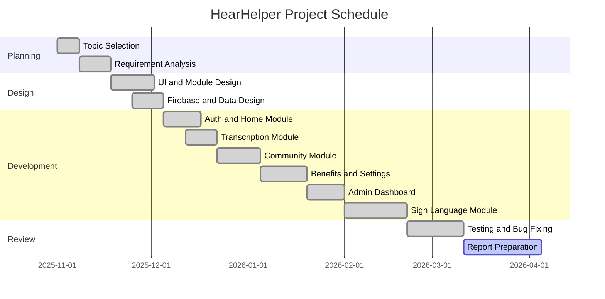

**Figure 7.1 - Development Gantt Chart**

## 7.4 Deployment Process

The deployed web application uses Firebase Hosting with the `public` folder as the hosting root, as specified in `firebase.json`. The deployment process can be summarized as follows:

1. prepare the `public` folder with the latest HTML, CSS, and JavaScript files,
2. verify Firebase configuration,
3. confirm Firestore rules and authentication setup,
4. deploy the static application to Firebase Hosting,
5. test critical routes after deployment.

The sign-language Python backend is not mandatory for the hosted application and may be treated as an optional local experimental service.

## 7.5 Maintenance Considerations

Future maintenance of the system should focus on:

- updating benefits content,
- improving Firestore rules,
- expanding sign-language gesture support,
- improving browser compatibility handling,
- refining admin analytics,
- and optimizing UI consistency.

The current modular file structure helps maintainability because each page has clear implementation boundaries.

## 7.6 Risk Register

| Risk ID | Risk | Likelihood | Impact | Mitigation |
|---|---|---|---|---|
| R1 | Browser API incompatibility | Medium | Medium | Provide browser guidance and fallback messaging |
| R2 | Firebase misconfiguration | Medium | High | Validate config and rules before deployment |
| R3 | Weak production security rules | High | High | Implement stricter access rules in future |
| R4 | Sign-language model limitation | High | Medium | Expand dataset and retrain model |
| R5 | Content becoming outdated | Medium | Medium | Review benefits and support information regularly |
| R6 | User permission denial for mic/camera | Medium | Medium | Provide guidance and permission prompts |

**Table 7.1 - Risk Register**

## 7.7 Maintenance Strategy

The following maintenance strategy is suitable for future versions of HearHelper:

1. **Corrective maintenance** for bug fixes and UI inconsistencies.
2. **Adaptive maintenance** for browser or Firebase SDK changes.
3. **Perfective maintenance** for performance, design, and usability improvements.
4. **Preventive maintenance** for stronger security and code quality review.

## 7.8 Summary of the Chapter

This chapter described how the project evolved over time, how it can be deployed, and what maintenance risks and strategies are relevant for its future growth.

\newpage

\newpage

# CHAPTER 8

# CONCLUSION AND FUTURE SCOPE

## 8.1 Conclusion

HearHelper was developed as an assistive communication web platform aimed at supporting hearing-impaired users through a combination of live transcription, messaging, sign-language assistance, personalization, benefits information, feedback capture, and administrative review. The current project demonstrates that accessibility-oriented software can be both technically meaningful and socially valuable within the scope of a BCA final year project.

One of the major strengths of HearHelper is its integrated nature. Many available tools focus on only one task, such as speech-to-text conversion or sign-language learning. HearHelper instead combines multiple related needs into a single web application. This is important because real-world users do not experience communication in isolated fragments. A user may need transcription in one moment, chat in another, sign reference later, and settings personalization throughout. By recognizing that communication support is a system-level need rather than a single feature, the project achieves greater relevance.

The technical choices made in the project also support its practical value. Firebase Authentication and Firestore provide a simple but modern cloud backbone. Browser speech APIs reduce backend dependency for real-time speech tasks. Local storage supports personalization. MediaPipe and the optional Python AI backend demonstrate a path toward more advanced gesture recognition. The resulting architecture is lightweight, understandable, extensible, and appropriate for demonstration and academic evaluation.

From a usability perspective, the project places visible emphasis on interface clarity. The home dashboard organizes features cleanly. The transcription interface is direct and utility-focused. The chat interface includes quick phrases that are especially suitable for accessibility use. The settings module acknowledges that different users have different communication preferences. The benefits page extends the project beyond communication mechanics into informational empowerment. The admin module adds monitoring capability, which strengthens the completeness of the system.

At the same time, the project remains honest about its limitations. The current system still depends on browser support, cloud connectivity, and development-stage Firestore rules. The sign-language AI component is promising but limited in vocabulary and maturity. These limitations do not weaken the academic value of the project; rather, they clarify the difference between a strong functional prototype and a full-scale production system.

Overall, HearHelper succeeds in meeting its major objectives. It proves that a modular web application can support communication accessibility meaningfully. It demonstrates the integration of front-end development, cloud services, accessibility principles, and exploratory AI. Most importantly, it shows how software engineering can be directed toward inclusion and social usefulness.

## 8.2 Limitations of the Current System

The current version of HearHelper has the following limitations:

1. Speech recognition quality depends on browser implementation, microphone quality, and environmental noise.
2. Continuous access to cloud-backed features requires an internet connection.
3. Firestore rules are presently permissive for demo convenience and should be hardened in future versions.
4. The sign-language module supports only a limited gesture vocabulary in the experimental backend.
5. Some personalized settings are stored locally rather than being fully synchronized per user in the cloud.
6. The benefits module is content-rich but currently static rather than auto-updated through verified service feeds.

These limitations identify a clear set of future improvement opportunities.

## 8.3 Future Scope

The future scope of HearHelper is significant. The platform can evolve in several directions:

1. **Stronger security and authorization** through stricter Firestore rules and role-based claims.
2. **Cloud-synced settings** so user preferences travel across devices.
3. **Expanded sign-language dataset** for richer recognition support.
4. **Mobile app version** using cross-platform frameworks or a progressive web app strategy.
5. **Offline-assisted mode** for selected features such as stored preferences and local references.
6. **Verified dynamic benefits updates** from maintained data sources.
7. **Improved analytics** for admin-side engagement and support trends.
8. **Multilingual accessibility improvements** across transcription, benefits, and instructional content.
9. **Stronger community moderation and safety tools** for messaging.
10. **Accessibility compliance enhancement** through more formal WCAG validation and assistive technology testing.

## 8.4 Social Relevance

A major outcome of this project is the recognition that accessibility software is not a luxury feature. It is a means of participation. When software helps a user understand speech, communicate independently, or find support resources, it contributes directly to social inclusion. HearHelper therefore represents a meaningful example of how student projects can move beyond routine management systems and instead address real user needs with empathy and technical rigor.

\newpage

# REFERENCES

1. MDN Web Docs, "Web Speech API," Mozilla Developer Network.  
2. Firebase Documentation, "Authentication," Google Firebase.  
3. Firebase Documentation, "Cloud Firestore," Google Firebase.  
4. Firebase Documentation, "Hosting," Google Firebase.  
5. MediaPipe Documentation, "Tasks Vision and Gesture Recognition," Google AI.  
6. TensorFlow Documentation, "Keras Sequential Models and LSTM Layers," TensorFlow.  
7. Flask Documentation, "Flask Web Framework," Pallets Project.  
8. Flask-SocketIO Documentation, "Real-Time Communication for Flask Applications."  
9. OpenCV Documentation, "Computer Vision Functions and Video Capture."  
10. NumPy Documentation, "Array Processing in Python."  
11. scikit-learn Documentation, "train_test_split and Machine Learning Utilities."  
12. W3C, "Web Content Accessibility Guidelines (WCAG)."  
13. ECMAScript Language Specification and JavaScript Reference resources.  
14. HTML5 and CSS3 standard references and web design documentation.  
15. Bangalore University BCA project report structure and departmental formatting practices as followed for academic submission preparation.  

\newpage

# APPENDIX A

# SCREEN-WISE USER MANUAL

## A.1 Introduction

This appendix explains how an end user can operate the current HearHelper system. It is useful both for project demonstration and for inclusion in the final academic report. The instructions below assume that the application has been deployed correctly and that Firebase services are configured.

## A.2 Landing and Home Flow

When the application opens, the user first sees the public entry or authenticated home flow depending on session state. The home dashboard presents feature cards that act as the primary navigation model of the application. The user should:

1. read the main feature overview,
2. choose the required module from the dashboard or top navigation,
3. use the help button if guidance is needed,
4. and provide feedback if they want to report suggestions or issues.

The dashboard is designed to act as a clear orientation layer rather than a dense portal. This improves usability for first-time users.

## A.3 Registration Steps

To create a new account:

1. open the registration page,
2. enter full name,
3. enter email address,
4. enter phone number,
5. choose hearing impairment type,
6. create a password,
7. confirm the password,
8. accept the terms and conditions,
9. click the create-account button.

If the registration is valid, Firebase creates the account and Firestore stores the profile document.

## A.4 Login Steps

To log in:

1. open the login page,
2. choose user mode or admin mode if applicable,
3. enter email and password,
4. click sign in,
5. wait for authentication confirmation,
6. access the home dashboard.

If the credentials are invalid, the system displays an appropriate alert. If the account is not authorized for admin access, the admin route is denied.

## A.5 Forgot Password Steps

If the user forgets the password:

1. open the forgot-password page,
2. enter the registered email address,
3. submit the form,
4. check the email inbox for the reset link,
5. complete password recovery through Firebase.

## A.6 Using Live Transcription

To use the live transcription module:

1. open the transcription page,
2. select the preferred language,
3. click `Start Listening`,
4. speak clearly into the microphone,
5. observe interim and final text,
6. click `Copy Text`, `Download`, `Speak`, or `Clear` as needed,
7. review saved entries in the transcription history section.

This module is especially useful when the user wants quick conversational understanding without typing.

## A.7 Using Community Connect

To use the community module:

1. open the community page,
2. wait for the contact list to load,
3. use the search box if necessary,
4. select a contact,
5. type a message or choose a quick phrase,
6. press send,
7. observe real-time message updates.

The profile settings icon allows the user to set an appearance name and status for use inside the community list.

## A.8 Using the Benefits Module

To use the benefits page:

1. open the benefits page,
2. review available schemes and categories,
3. use the filter buttons to narrow content,
4. read eligibility, amount, document requirements, and links,
5. follow the provided action buttons for more information.

This module is meant for informational support and awareness rather than direct service automation.

## A.9 Using the Settings Module

To use the settings page:

1. open settings,
2. navigate between display, audio, profile, and about tabs,
3. adjust font size,
4. adjust volume, speech rate, and pitch,
5. choose a voice and language if needed,
6. update profile details,
7. click save-all changes,
8. use reset-to-defaults if needed.

The settings module allows the application experience to adapt to user comfort and readability.

## A.10 Using the Sign Language Module

To use the sign-language page:

1. open the sign-language module,
2. allow webcam access,
3. click `Enable AI Camera`,
4. show a gesture to the webcam,
5. observe the live gesture output and emoji,
6. allow stable gestures to accumulate into the sentence area,
7. click `Speak`, `Save`, or `Clear` as needed,
8. review saved history items.

If the optional Python backend is running, the module may also use backend predictions.

## A.11 Using the Feedback System

To send feedback:

1. open the help or feedback entry from the interface,
2. enter name and email,
3. choose the type and rating,
4. write the message,
5. submit the form,
6. verify success notification.

## A.12 Using the Admin Dashboard

For an authorized admin:

1. log in through admin mode with authorized credentials,
2. open the admin dashboard,
3. review total users and feedback counts,
4. switch between dashboard, users, feedback, analytics, and settings sections,
5. monitor chart trends and table records.

## A.13 User Manual Summary Table

| Screen | Main Purpose | Key Actions |
|---|---|---|
| Login | User authentication | Sign in, choose user/admin mode |
| Register | New account creation | Enter details and create account |
| Forgot Password | Account recovery | Send reset link |
| Home | Central dashboard | Navigate to modules |
| Transcription | Real-time speech-to-text | Start listening, copy, download, speak |
| Community | User chat | Select contact, send message |
| Benefits | Informational support | Filter and read scheme details |
| Settings | Personalization | Save font, audio, and profile changes |
| Sign Language | Gesture assistance | Start camera, read output, form sentence |
| Admin | Monitoring | Review users, feedback, charts |

**Table A.1 - Screen-Wise User Manual Summary**

\newpage

# APPENDIX B

# DATABASE AND DATA STRUCTURE NOTES

## B.1 Firestore Collection Structure

| Collection | Purpose | Key Fields |
|---|---|---|
| `users` | User profile storage | `fullName`, `email`, `phone`, `hearingType`, `displayName`, `privacyStatus`, `createdAt` |
| `messages` | Real-time chat storage | `text`, `senderId`, `receiverId`, `participants`, `timestamp` |
| `feedback` | Help and support feedback | `name`, `email`, `type`, `rating`, `message`, `timestamp` |

**Table B.1 - Firestore Collection Structure**

## B.2 Example User Document

```json
{
  "fullName": "Ganesh",
  "email": "ganesh@example.com",
  "phone": "9876543210",
  "hearingType": "Hard of Hearing",
  "displayName": "Ganesh G",
  "privacyStatus": "Available",
  "createdAt": "2026-03-15T10:00:00.000Z"
}
```

## B.3 Example Message Document

```json
{
  "text": "Hello, can you repeat that?",
  "senderId": "uid_001",
  "receiverId": "uid_002",
  "participants": ["uid_001", "uid_002"],
  "timestamp": "serverTimestamp"
}
```

## B.4 Example Feedback Document

```json
{
  "name": "Puneeth",
  "email": "puneeth@example.com",
  "type": "improvement",
  "rating": "5",
  "message": "The transcription module is very helpful.",
  "timestamp": "2026-04-01T12:30:00.000Z"
}
```

## B.5 Local Storage Notes

The project also uses local storage for:

- display settings,
- voice settings,
- profile values,
- transcript history in page-level logic,
- and sign-language history.

This is suitable for personalized lightweight data that does not always need cloud synchronization.

\newpage

# APPENDIX C

# PROJECT FOLDER AND FILE DESCRIPTION

## C.1 Current High-Level Folder Layout

```text
Original Project 1/
├── public/
│   ├── home.html
│   ├── index.html
│   ├── css/
│   ├── js/
│   └── pages/
├── AI Project/
│   ├── Python_Backend/
│   └── Sign_Language_Translator/
├── firebase.json
├── firestore.rules
└── HearHelper_Bangalore_University_Project_Report.md
```

## C.2 File Purpose Notes

### C.2.1 `public/home.html`

Acts as the central dashboard for authenticated users and presents the primary modules of the system.

### C.2.2 `public/js/auth.js`

Maintains authentication state, updates navigation for logged-in users, and controls logout behavior.

### C.2.3 `public/js/firebase-config.js`

Initializes Firebase app, authentication, and Firestore configuration.

### C.2.4 `public/pages/transcription.html`

Contains the real-time transcription UI and page-level speech-recognition management.

### C.2.5 `public/js/community_connect.js`

Implements user list loading, message sending, message subscription, and profile modal updates.

### C.2.6 `public/js/benefits.js`

Implements benefits-category filtering behavior for the information portal.

### C.2.7 `public/js/storage.js`

Maintains local settings and lightweight user data in browser storage.

### C.2.8 `public/js/sign_language_ai.js`

Implements webcam-based gesture recognition, sentence formation, history storage, and optional backend streaming.

### C.2.9 `public/js/admin.js`

Implements admin dashboard behavior, Firestore snapshot listeners, counts, rendering, and route protection.

### C.2.10 `AI Project/Python_Backend/app.py`

Provides an optional real-time Flask-SocketIO backend for sign-language model inference.

### C.2.11 `AI Project/Python_Backend/collect_data.py`

Captures landmark datasets for sign-language model training.

### C.2.12 `AI Project/Python_Backend/train_model.py`

Builds and trains the LSTM-based gesture-recognition model.

\newpage

\newpage

# APPENDIX D

# EXTENDED TEST CASE CATALOGUE

## D.1 Authentication Test Cases

| Test ID | Scenario | Input | Expected Result |
|---|---|---|---|
| AUTH01 | Valid registration | Correct form values | User created successfully |
| AUTH02 | Duplicate registration | Existing email | Error shown |
| AUTH03 | Weak password | Short password | Validation error |
| AUTH04 | Mismatched password | Different password values | Validation error |
| AUTH05 | Valid login | Correct credentials | Redirect to dashboard |
| AUTH06 | Invalid login | Wrong password | Error message |
| AUTH07 | Admin login authorized | Allowed admin email and correct password | Redirect to admin page |
| AUTH08 | Admin login unauthorized | Non-admin email in admin mode | Access denied |
| AUTH09 | Forgot password valid | Registered email | Reset mail sent |
| AUTH10 | Forgot password invalid | Unknown email | Error displayed |

## D.2 Transcription Test Cases

| Test ID | Scenario | Expected Result |
|---|---|---|
| TR01 | Start listening | Mic state and listening badge should activate |
| TR02 | Stop listening | Recognition should stop cleanly |
| TR03 | Speak English | Text should appear |
| TR04 | Change language | Recognition language should update |
| TR05 | Copy text | Clipboard should receive transcript |
| TR06 | Download text | Downloaded file should contain transcript |
| TR07 | Clear transcript | Output should reset |
| TR08 | Speak transcript | TTS should read visible transcript |
| TR09 | Empty transcript download | System should not fail or crash |
| TR10 | Browser without recognition support | Error or unsupported message should appear |

## D.3 Community Test Cases

| Test ID | Scenario | Expected Result |
|---|---|---|
| COM01 | Load contacts | Contacts should render from users collection |
| COM02 | Search contacts | Filtered matching contacts should appear |
| COM03 | Select contact | Chat panel should activate |
| COM04 | Send text | Message document should be created |
| COM05 | Press Enter to send | Message should send |
| COM06 | Send quick phrase | Phrase should appear as message |
| COM07 | Update profile modal | User document should update |
| COM08 | Empty message send | No message should be sent |
| COM09 | Real-time update | Incoming message should appear without refresh |
| COM10 | Logout from community page | Session should close successfully |

## D.4 Sign Language Test Cases

| Test ID | Scenario | Expected Result |
|---|---|---|
| SG01 | Enable camera | Webcam stream should start |
| SG02 | Disable camera | Webcam stream should stop |
| SG03 | Show supported gesture | UI should display phrase |
| SG04 | Hold stable gesture | Sentence should update only after threshold |
| SG05 | Repeat same gesture continuously | Duplicate word should be reduced |
| SG06 | Speak sentence | TTS should speak formed sentence |
| SG07 | Save sentence | Sentence should enter history |
| SG08 | Clear sentence | Sentence panel should reset |
| SG09 | Clear history | Stored local history should be removed |
| SG10 | Python backend unavailable | Local mode should still function |

## D.5 Benefits, Settings, and Admin Test Cases

| Test ID | Scenario | Expected Result |
|---|---|---|
| GEN01 | Benefits page load | All cards should show initially |
| GEN02 | Filter benefits | Matching cards only should display |
| GEN03 | Change font size | UI readability should improve |
| GEN04 | Change speech rate | TTS should use updated value |
| GEN05 | Reset settings | Defaults should restore |
| GEN06 | Submit feedback | Firestore feedback record should be created |
| GEN07 | Admin open dashboard | Counts and tables should render |
| GEN08 | Admin view users | User list should appear |
| GEN09 | Admin view feedback | Feedback list should appear |
| GEN10 | Unauthorized admin access | Redirect should occur |

\newpage

# APPENDIX E

# PSEUDOCODE OF CORE MODULES

## E.1 Authentication Pseudocode

```text
START
  Load Firebase Authentication
  Listen to auth state changes
  IF user exists THEN
      update navigation
      allow protected page access
  ELSE
      redirect protected pages to login or index
  ENDIF

  On registration submit:
      validate form values
      create account in Firebase Auth
      store profile data in Firestore users collection

  On login submit:
      validate credentials
      sign in through Firebase Auth
      IF admin mode selected AND email authorized THEN
          set admin session
          redirect admin page
      ELSE
          redirect home page
      ENDIF
END
```

## E.2 Transcription Pseudocode

```text
START
  Initialize SpeechRecognition object
  Set language, continuous mode, interim results
  On start:
      show listening state
  On result:
      separate interim and final transcript
      update transcript display
  On error:
      show error and stop recognition
  On stop:
      reset mic state
  Provide utilities:
      copy transcript
      download transcript
      clear transcript
      speak transcript using speech synthesis
END
```

## E.3 Community Chat Pseudocode

```text
START
  Wait for auth state
  IF user logged in THEN
      load users from Firestore
      show contacts except current user
  ENDIF

  On contact selection:
      set active contact
      subscribe to Firestore messages
      filter messages by selected participants
      sort messages by timestamp
      render messages

  On send:
      IF message text not empty THEN
          add message document to Firestore
      ENDIF
END
```

## E.4 Sign Language Recognition Pseudocode

```text
START
  Load MediaPipe gesture recognizer
  On camera start:
      open webcam stream
      begin frame loop
  For each frame:
      run gesture recognition
      map result to phrase and emoji
      IF gesture stable for threshold frames THEN
          add phrase to sentence
      ENDIF
      IF python backend connected THEN
          send landmarks to backend
          receive optional model prediction
      ENDIF
  Allow user to:
      speak sentence
      save sentence
      clear sentence
      clear history
END
```

## E.5 Admin Dashboard Pseudocode

```text
START
  Verify current user is authorized admin
  Attach snapshot listeners to users and feedback collections
  On collection update:
      build arrays for rendering
      update dashboard counts
      update user and feedback tables
      refresh chart values
END
```

\newpage

# APPENDIX F

# GLOSSARY AND TECHNICAL NOTES

## F.1 Glossary

**Accessibility:** The design of systems so that people with disabilities can use them effectively.  
**Authentication:** The process of verifying the identity of a user.  
**Authorization:** The process of deciding what an authenticated user is allowed to do.  
**Cloud Firestore:** A NoSQL cloud database from Firebase used for storing structured application data.  
**Firebase Authentication:** A managed identity service used for secure user sign-up and sign-in.  
**Gesture Recognition:** The process of identifying hand or body gestures from visual input.  
**Local Storage:** Browser-based persistent key-value storage for client-side data.  
**MediaPipe:** A framework for building perception pipelines such as hand and gesture recognition.  
**Real-Time Listener:** A Firestore mechanism that updates the client when cloud data changes.  
**Speech Synthesis:** The generation of spoken audio from text.  
**Speech Recognition:** The conversion of spoken audio into text.  
**Web Application:** Software accessed through a web browser.  

## F.2 Notes on Accessibility Design

Accessibility design in HearHelper goes beyond simply adding large buttons. The project attempts to support real communication scenarios by combining readable content, user-controlled settings, and response-oriented modules. Practical accessibility in this project includes:

- visible navigation,
- scalable text,
- quick phrase shortcuts,
- speech output,
- transcript history,
- and reduced need for complex menu paths.

## F.3 Notes on Cloud Integration

Firebase was selected because it allows the project to focus on application logic rather than server administration. In an academic context, this is especially useful because it:

1. reduces boilerplate backend work,
2. improves reliability of sign-in,
3. enables real-time updates,
4. supports fast prototyping.

## F.4 Notes on AI Integration

The AI portion of the project should be interpreted as an exploratory but meaningful extension. It shows how the system can evolve beyond rule-based or static interfaces into recognition-driven accessibility support. Even though the current model is limited, it provides a strong research direction for future work.

\newpage

# APPENDIX G

# VIVA VOCE SUPPORT QUESTIONS AND ANSWERS

## G.1 Sample Viva Questions

1. **What problem does HearHelper solve?**  
   HearHelper reduces communication barriers for hearing-impaired users by combining transcription, chat, settings, benefits information, and sign-language assistance in one web platform.

2. **Why did you choose Firebase?**  
   Firebase simplified authentication, cloud storage, and hosting, allowing the project to focus on user-facing accessibility features.

3. **Why is this project browser-based instead of desktop-based?**  
   A browser-based system is easier to access across devices, easier to deploy, and more cost-effective for users.

4. **What is the role of Web Speech API in your project?**  
   It enables real-time speech recognition and text-to-speech without requiring a separate speech backend.

5. **How does the community module work?**  
   It stores and retrieves chat messages from Firestore using real-time snapshot listeners.

6. **What are the major collections in the database?**  
   `users`, `messages`, and `feedback`.

7. **How is sign-language support implemented?**  
   Through a browser-based MediaPipe gesture recognizer and an optional Python backend for model-based prediction.

8. **Why is the sign-language backend optional?**  
   To keep the main application usable even if the experimental AI service is not running.

9. **What are the main limitations of the current system?**  
   Browser dependency, open Firestore rules for demo use, limited sign vocabulary, and internet dependence for cloud modules.

10. **How can the system be improved in future?**  
    By adding stricter security, larger AI datasets, better multilingual support, cloud-synced preferences, and mobile deployment.

11. **Why is the benefits module part of the project?**  
    Accessibility support is broader than direct communication; users also need access to useful scheme and support information.

12. **What is the significance of quick phrases in chat?**  
    They reduce effort and improve accessibility in repeated communication scenarios.

13. **What software process model did you follow?**  
    Incremental prototyping, because modules were built and refined step by step.

14. **What is the academic contribution of this project?**  
    It integrates front-end development, cloud services, accessibility design, and AI experimentation in one cohesive final-year project.

15. **How is the admin dashboard protected?**  
    Through authenticated access with an authorized admin email and admin session validation.

\newpage

# APPENDIX H

# FINAL REPORT FORMATTING CHECKLIST

Before final university submission, the following checklist should be completed:

1. Replace all placeholder values such as guide name, HOD name, principal name, USN, and college name.
2. Export the report into the department-approved document format.
3. Apply final page numbers and update the contents page.
4. Ensure chapter headings follow department formatting.
5. Render all Mermaid diagrams properly or recreate them in Word/Visio if required.
6. Add actual screenshots of key pages if your department expects them.
7. Verify certificate and declaration wording with the guide.
8. Review spelling, capitalization, and table numbering.
9. Print only after guide approval.
10. Use the approved binding format as instructed by the department.

\newpage

# APPENDIX I

# SUGGESTED SCREENSHOTS AND FIGURE CAPTIONS

## I.1 Purpose of This Appendix

For a final printed project report, screenshots significantly improve readability and perceived completeness. They also help the evaluator connect the implementation chapter to the actual interface. Since this report is prepared from the current repository and not from a screenshot bundle, this appendix provides a list of recommended screenshots and suggested captions that can be inserted before final printing.

## I.2 Recommended Screenshot List

### Figure I.1 - Login Page

**Suggested Caption:** Login interface showing user and admin mode selection, email/password input, and validation-friendly layout.  
**What to capture:** Full login form with toggle visible and clean background.

### Figure I.2 - Registration Page

**Suggested Caption:** Registration form for new HearHelper users with full name, email, phone, hearing type, and password validation controls.  
**What to capture:** Entire form including password strength bar.

### Figure I.3 - Home Dashboard

**Suggested Caption:** Home dashboard displaying core HearHelper modules such as live transcription, community connect, sign language, benefits, and settings.  
**What to capture:** Dashboard cards and hero section.

### Figure I.4 - Live Transcription Page

**Suggested Caption:** Real-time transcription interface showing language selection, mic controls, status badge, final transcript, and history panel.  
**What to capture:** One screenshot while listening and one after transcript generation.

### Figure I.5 - Community Connect Page

**Suggested Caption:** Community chat page with contact list, active conversation panel, quick response phrases, and profile settings option.  
**What to capture:** Chat interface with at least one message thread.

### Figure I.6 - Benefits Information Page

**Suggested Caption:** Benefits portal displaying categorized accessibility support information for users.  
**What to capture:** Filter buttons and multiple benefit cards visible.

### Figure I.7 - Settings Page

**Suggested Caption:** Personalization page showing font, audio, and profile preferences for the current user.  
**What to capture:** Display and audio tabs with controls.

### Figure I.8 - Sign Language Module

**Suggested Caption:** Sign-language assistance page with webcam panel, live gesture result, sentence formation area, and history section.  
**What to capture:** Visible recognition result and current sentence.

### Figure I.9 - Feedback Modal

**Suggested Caption:** Feedback submission interface allowing users to rate and submit suggestions to the HearHelper team.  
**What to capture:** Open feedback modal with fields visible.

### Figure I.10 - Admin Dashboard Overview

**Suggested Caption:** Admin dashboard overview displaying user statistics, feedback counts, and recent records.  
**What to capture:** Dashboard statistics and chart section.

### Figure I.11 - Users Table in Admin Panel

**Suggested Caption:** Admin user management view showing registered users and basic operational actions.  
**What to capture:** Users table with sample records.

### Figure I.12 - Feedback Table in Admin Panel

**Suggested Caption:** Admin feedback monitoring view showing feedback messages submitted by users.  
**What to capture:** Feedback table with sample entries.

### Figure I.13 - Sign Language AI Local Mode

**Suggested Caption:** Browser-side sign-language recognition running without the optional Python backend.  
**What to capture:** Status badge indicating local mode.

### Figure I.14 - Sign Language AI with Backend Connected

**Suggested Caption:** Extended sign-language recognition workflow with Python AI backend available for experimental inference.  
**What to capture:** Status change or backend-connected behavior, if possible.

### Figure I.15 - Firebase Console Reference Screenshot

**Suggested Caption:** Example project setup view in Firebase showing authentication and Firestore services used by HearHelper.  
**What to capture:** Only if allowed and without exposing sensitive credentials.

## I.3 Screenshot Insertion Guidelines

When preparing the final printed report:

1. Use clear screenshots with readable text.
2. Avoid showing unnecessary browser chrome if it reduces focus.
3. Insert screenshots near the relevant module explanation.
4. Provide captions below each screenshot.
5. Number screenshots consistently.
6. Avoid exposing secret keys, personal emails, or admin-only details.

## I.4 Suggested Placement Strategy

The screenshots may be distributed across the report as follows:

- authentication screenshots in Chapter 5,
- dashboard and main workflow screenshots in Chapter 5,
- admin screenshots in Chapter 5 or Chapter 6,
- and specialized AI screenshots in Chapter 5 under sign-language implementation.

This strategy helps the report feel visually balanced and closer to a formal university submission.

\newpage

# APPENDIX J

# DETAILED MODULE WALKTHROUGH AND TECHNICAL COMMENTARY

## J.1 Why a Detailed Technical Walkthrough Is Useful

In many academic project reports, the implementation chapter summarizes features but does not fully connect them to actual repository structure. Since HearHelper contains both core user-facing modules and experimental AI-support files, a deeper technical walkthrough helps clarify how the current project is really organized. This appendix can also help during viva voce because it explains design reasoning rather than only repeating feature names.

## J.2 Authentication Walkthrough

The authentication layer in HearHelper is conceptually divided into three parts:

1. page-level UI for login, registration, and password reset,
2. Firebase Authentication calls for identity handling,
3. Firestore document management for profile-like user information.

This division is a sound design choice because authentication credentials should not be mixed unnecessarily with profile data. During registration, the system first validates password rules and terms acceptance. After a successful Firebase account creation, the system writes profile fields such as name, phone number, and hearing type into the `users` collection. This pattern is scalable and aligns with practical cloud application structure.

The login layer also demonstrates a useful lesson learned during project cleanup. The earlier logic used a hardcoded admin credential path, which was not ideal. In the current version, admin access is tied to Firebase authentication plus admin eligibility logic. This change makes the project easier to justify academically because it replaces an obviously weak practice with a more structured approach.

## J.3 Dashboard and Navigation Walkthrough

The dashboard is more than a visual homepage. It is the application’s operational hub. The layout presents feature cards with immediate navigation paths. This is especially appropriate for accessibility-centered design because it reduces the need for deep navigation trees or hidden features.

The shared navigation script is intentionally lightweight. It handles:

- responsive menu toggling,
- active link state updates,
- and simple navigation effects.

Even though this may appear simple, consistent navigation is crucial in a multi-page project. Without it, the system would feel fragmented and the learning curve for new users would increase.

## J.4 Transcription Walkthrough

The transcription page is a strong example of browser-native assistive functionality. Instead of sending audio to a custom backend, the module leverages the browser’s speech-recognition capabilities. This approach is useful in a student project for several reasons:

1. it reduces infrastructure complexity,
2. it improves immediacy,
3. it demonstrates smart reuse of platform features,
4. and it allows the project to focus on UX and integration rather than low-level speech engine creation.

The page does not stop at transcription alone. It also includes language selection, transcript history, copy-to-clipboard support, download support, and speech output. These additions significantly improve usability. A plain transcript box would demonstrate only proof of concept. The present design demonstrates practical utility.

## J.5 Community Walkthrough

The community module deserves special mention because it moves the project beyond one-way assistive output and into actual social communication. In this module:

- the authenticated user is established first,
- contacts are loaded from the `users` collection,
- the active contact is selected from the UI,
- relevant messages are subscribed to in real time,
- and chat history is rendered in a conversational format.

The project also includes a profile modal that allows the user to adjust visible display name and privacy status. This is a thoughtful addition because users may want different presentation identities inside a community environment.

The use of quick phrases is especially relevant in this module. Accessibility design often benefits from action shortcuts. Common phrases such as “Yes,” “No,” “Can you repeat?”, or “Thank you” can reduce typing burden and make communication faster and less stressful.

## J.6 Benefits Module Walkthrough

At first glance, the benefits page may appear informational rather than technical. However, it contributes significantly to the project’s identity. Assistive applications are most effective when they understand the user’s broader context. Communication support is important, but so is access to welfare-related information, scholarships, and concessions.

Technically, the benefits module uses a content-rich HTML structure combined with category-based filtering in JavaScript. The logic is intentionally simple and transparent. This is a good decision for a final-year project because the value of the module lies more in thoughtful presentation than in algorithmic complexity.

## J.7 Settings Walkthrough

The settings page demonstrates the project’s understanding of personalization. Different users have different reading comfort, different speech playback preferences, and different identity details they want reflected in the interface. The use of local storage provides a quick and effective persistence mechanism for these preferences.

From a design standpoint, the settings module also shows how accessibility can be embedded directly into software architecture. Rather than treating font size or voice preferences as optional extras, HearHelper includes them as a first-class module. This strengthens the report academically because it reflects user-centered thinking.

## J.8 Sign Language Module Walkthrough

The sign-language module is arguably the most technically ambitious part of the project. It blends:

- webcam access,
- live visual rendering,
- browser-side MediaPipe inference,
- phrase mapping,
- sentence building,
- local history,
- speech synthesis,
- and optional backend prediction.

The sentence formation logic is especially interesting. Instead of adding every detected gesture immediately, the system waits until the gesture remains stable for a threshold number of frames. This helps reduce false positives and repeated rapid insertion. It demonstrates a strong practical understanding of how noisy perception systems can be made more usable.

The optional Python backend further increases the academic depth of the module. It shows that the project is not limited to rule-based or fixed-API behavior. The inclusion of dataset collection, training, and inference scripts makes it possible to discuss a full AI experimentation pipeline:

1. collect gesture landmark data,
2. store sequences,
3. train an LSTM model,
4. deploy the model,
5. receive predictions over a socket interface.

This is valuable in a BCA project because it shows both software engineering and applied ML awareness.

## J.9 Feedback and Admin Walkthrough

The feedback flow and admin dashboard together form a small but meaningful governance layer in the system. Users can submit their impressions or issues. Admins can review aggregate counts and lists. Even though the admin features are not enterprise-grade, they make the project feel more complete and operational.

The admin charts and counts demonstrate that the project is capable of basic analytical presentation, not just transactional interaction. This is useful in academic evaluation because it shows the project from both the user side and the monitoring side.

## J.10 Technical Trade-Offs

HearHelper includes several deliberate trade-offs:

### J.10.1 Simplicity vs. Strict Security

For academic demonstration, the project keeps Firestore rules permissive. This simplifies setup and data flow during presentation, but it sacrifices production-grade security. The report must acknowledge this clearly, which it does.

### J.10.2 Browser-Native APIs vs. Cross-Browser Uniformity

Using browser speech APIs makes development efficient, but compatibility varies across browsers. The benefit is fast prototyping and good performance where supported; the cost is reduced predictability on unsupported platforms.

### J.10.3 Local Storage vs. Full Cloud Sync

Local storage is sufficient for many preference values and reduces cloud complexity. However, it means some personalization does not automatically follow the user across devices. This is acceptable in the current project stage and can be improved later.

### J.10.4 Experimental AI vs. Stable Core Features

The project wisely keeps AI assistance as an extension rather than as a mandatory dependency. This protects the usability of the core system while still enabling advanced experimentation.

## J.11 Lessons Learned

The development of HearHelper leads to several important lessons:

1. Accessibility should be treated as a design principle, not an afterthought.
2. Managed cloud services can greatly accelerate student project development.
3. Browser APIs can provide powerful assistive features with relatively little infrastructure.
4. Modular design makes late-stage cleanup and documentation much easier.
5. Honest reporting of limitations strengthens, rather than weakens, an academic project.

## J.12 Academic Discussion Value

This appendix is also useful in viva voce because it helps the student explain not only what the project does, but why it was designed in a particular way. Examiners often ask about design choices, trade-offs, and future improvements. The details in this appendix can support those answers.

\newpage

# APPENDIX K

# ACCESSIBILITY REVIEW CHECKLIST

## K.1 Interface-Level Accessibility Checklist

| Area | Review Question | Current Observation |
|---|---|---|
| Navigation | Are main modules reachable in one or two actions? | Yes |
| Font Adjustment | Can the user increase readability? | Yes |
| Feedback Visibility | Are key actions clearly labeled? | Yes |
| Status Indicators | Are mic / AI / action states visible? | Yes |
| Quick Communication | Are there shortcuts for common phrases? | Yes |
| Audio Output | Can text be spoken aloud? | Yes |
| Sign Support | Is there visual feedback for gestures? | Yes |
| User Guidance | Is help or support visible? | Yes |

## K.2 Recommendations for Further Accessibility Improvement

1. Add ARIA labels and formal screen-reader testing across all pages.
2. Provide more explicit keyboard navigation support for all interactive controls.
3. Add color-contrast review across all pages.
4. Add optional dyslexia-friendly font themes if required.
5. Include speech-to-text usage guidance for low-noise input conditions.
6. Add more visual onboarding for first-time users.

\newpage

# END OF REPORT
