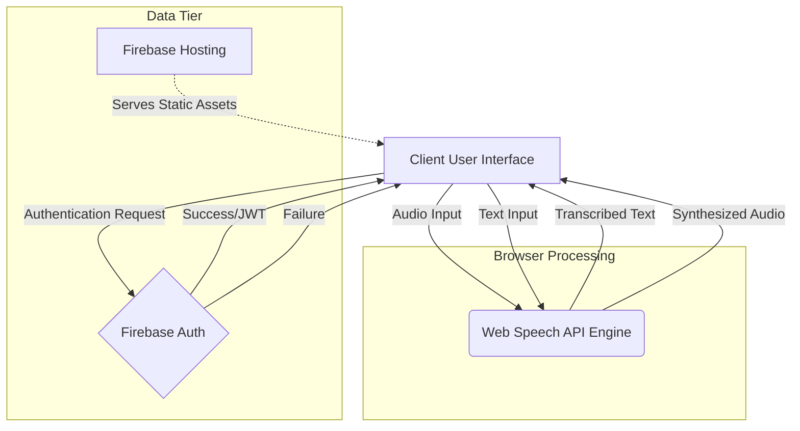
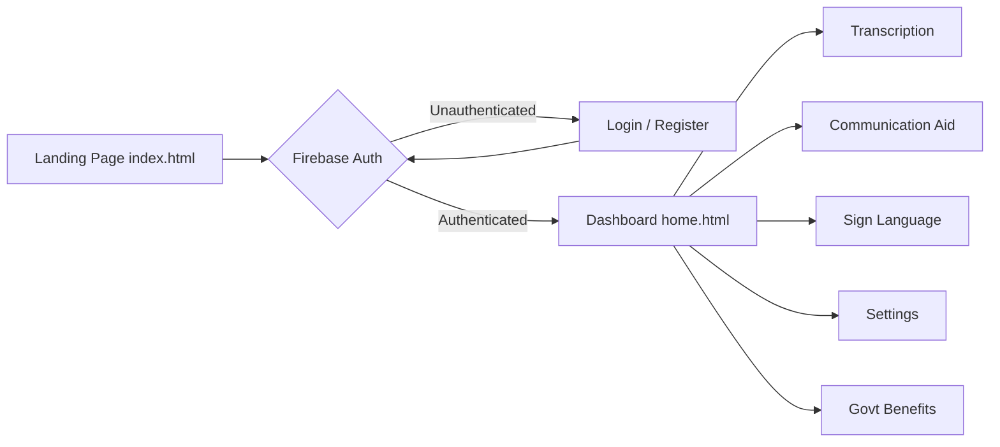
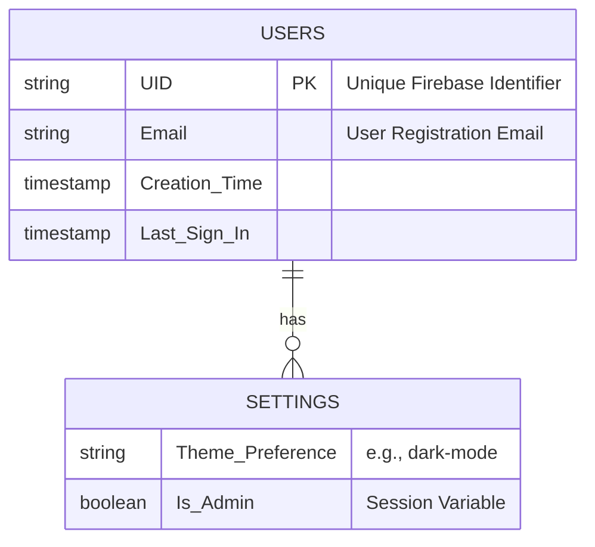

# HEARHELPER - FINAL PROJECT REPORT

---

# TABLE OF CONTENTS
1. [Introduction](#1-introduction)
2. [Problem Statement](#2-problem-statement)
3. [Objectives & Scope](#3-objectives--scope)
4. [Existing System vs. Proposed System](#4-existing-system-vs-proposed-system)
5. [System Requirements](#5-system-requirements)
6. [Technology Stack](#6-technology-stack)
7. [System Architecture](#7-system-architecture)
8. [Module Description](#8-module-description)
9. [Database Design](#9-database-design)
10. [User Interface Design](#10-user-interface-design)
11. [Implementation Details](#11-implementation-details)
12. [Testing & Quality Assurance](#12-testing--quality-assurance)
13. [Future Scope](#13-future-scope)
14. [Conclusion](#14-conclusion)
15. [References](#15-references)

---

## 1. Introduction
Communication is a fundamental bridge connecting human beings. However, for the millions of people living with hearing and speech impairments, traversing this bridge is fraught with daily challenges. From ordering a coffee to understanding medical advice, the communication barrier leads to isolation, reduced accessibility, and countless missed opportunities for seamless interaction in a society largely oriented towards spoken languages. **HearHelper** is formulated to dismantle these barriers.

HearHelper is an innovative, inclusive web application conceptualized to bridge the pervasive communication gap between the hearing-impaired community and society at large. The platform leverages cutting-edge web technologies and modern Application Programming Interfaces (APIs) to provide real-time speech-to-text transcription, text-to-speech output, an interactive two-way communication dashboard, and an integrated sign language learning module.

By unifying multiple assistive technologies under a centralized, user-friendly digital ecosystem, HearHelper empowers users to participate in conversations effortlessly. The system caters to both individuals experiencing hearing difficulty and those who wish to communicate effectively with them, fostering an environment of inclusivity, mutual understanding, and equitable access.

## 2. Problem Statement
Despite considerable advancements in assistive technologies, a severe chasm persists in accessible, low-latency communication solutions for people with hearing and speech difficulties. 

The primary challenges include:
*   **Real-time Interaction Delays:** Existing transcription services often lag, making natural, fluid conversations nearly impossible.
*   **Fragmented Solutions:** Users frequently have to shuffle between multiple applications—one for transcription (speech-to-text), another for vocalization (text-to-speech), and yet another to learn or reference sign language.
*   **Accessibility Constraints:** Many platforms feature complex, visually cluttered user interfaces that are not optimized for rapid deployment in high-stakes or emergency scenarios.
*   **High Costs and Proprietary Hardware:** Traditional assistive communication devices are prohibitively expensive, effectively alienating individuals from lower socio-economic backgrounds.
*   **Lack of Awareness regarding Government Benefits:** Hearing-impaired individuals frequently miss out on state and federal benefits curated for their welfare due to information silos.

Therefore, the problem at hand demands the creation of an inclusive, reliable, web-based software solution that operates efficiently on mainstream hardware, eliminating the need for exorbitant proprietary devices while uniting all crucial communication modalities into one intuitive interface.

## 3. Objectives & Scope

### 3.1 Primary Objectives
1.  **Facilitate Real-time Communication:** Implement zero-latency Speech-to-Text (STT) and Text-to-Speech (TTS) functionalities enabling synchronous two-way conversations.
2.  **Provide a Centralized Hub:** Consolidate disparate tools—transcription, communication aid, and sign language learning—into a unified web application.
3.  **Ensure Accessibility:** Design an empathetic, easy-to-navigate User Interface (UI) featuring high contrast themes (Dark Mode), scalable text, and intuitive iconography.
4.  **Promote Inclusivity & Education:** Provide a dedicated module connecting users to Sign Language learning resources (e.g., ASL/BSL) encouraging the hearing community to engage in inclusive practices.
5.  **Information Dissemination:** Act as an aggregator for Government benefits and subsidies relevant to the hearing and speech impaired community, increasing awareness and utilization of these resources.

### 3.2 Scope of the Project
The project scope is inherently encompassing, targeting continuous, daily-use communication scenarios. HearHelper provides:
*   **Cross-platform Compatibility:** Being a web-based application, it runs flawlessly on any modern browser across Windows, macOS, Android, and iOS.
*   **User Registration & Authentication:** Secure, robust user profiles managed via Firebase Authentication to personalize settings and secure user data.
*   **Dynamic UI rendering:** A responsive, interactive interface accommodating all screen sizes (mobile, tablet, desktop).
*   **Limitations:** The current scope relies on persistent Internet connectivity for Cloud APIs to function. Offline capability is heavily constrained by browser constraints.

## 4. Existing System vs. Proposed System

### 4.1 Existing System
Currently, the landscape is populated heavily by individual applications fulfilling highly specific niches:
*   **Live Transcribe (Google):** Excellent for STT but lacks native Text-to-Speech playback or an integrated dashboard for pre-saved conversational phrases.
*   **Dedicated ASL Apps:** Useful for learning sign language, but operate entirely separate from conversational aids.
*   **Specialized Medical Devices:** Expensive and require proprietary maintenance.
*   **General Purpose Messaging Apps (WhatsApp, Telegram):** Not optimized for live, face-to-face assisted communication scenarios.

**Drawbacks of Existing Systems:**
*   High cost.
*   Lack of integration.
*   Steep learning curves.
*   No centralized portal for related resources (e.g., benefits, settings).

### 4.2 Proposed System (HearHelper)
HearHelper negates these constraints by offering an all-in-one suite. 
*   **Integration:** STT and TTS run simultaneously within the `CommunicationAid` module.
*   **Cost-Effective:** Hosted via Firebase, operated via modern web browsers; the application is 100% free for the end-user.
*   **Empathetic UI/UX:** Styled beautifully using advanced CSS (Glassmorphism, gradients, micro-animations) to ensure the platform feels modern, approachable, and premium rather than clinical or medical.
*   **Resource Aggregation:** Features like the `Benefits` and `Sign Language` modules provide unprecedented value by moving beyond immediate communication and into long-term lifestyle support.

## 5. System Requirements

### 5.1 Hardware Requirements
*   **Processor:** Modern Dual-Core Processor (1.6 GHz or higher) is sufficient.
*   **Memory (RAM):** Minimum 2 GB (4 GB Recommended) for stable browser performance.
*   **Storage:** Minimal local storage required (Cloud-hosted architecture).
*   **Peripherals:** Functioning Microphone (internal or external) and Speakers/Headphones.

### 5.2 Software Requirements
*   **Operating System:** Windows, macOS, Linux, Android, iOS.
*   **Web Browser:** Google Chrome v80+, Mozilla Firefox v80+, Microsoft Edge v80+, or Apple Safari v13+ (Browsers supporting Web Speech API).
*   **Internet Connection:** Required for API communication and Firebase Backend synchronization.

## 6. Technology Stack

HearHelper is built strictly around universal Web Standards to maximize reach and minimize setup friction.

### 6.1 Frontend Development
*   **HTML5:** The structural backbone of the web pages, providing semantic value and ensuring screen-reader accessibility.
*   **Variables CSS (Cascading Style Sheets 3):** Employed rigorously to build a highly responsive, animated, and dark-mode capable presentation layer. We utilized Vanilla CSS to maintain performance without the overhead of heavy frameworks like Bootstrap, allowing for bespoke, premium aesthetics.
*   **Vanilla JavaScript (ES6+):** Governs the dynamic logic, DOM manipulation, asynchronous API requests, and user interactions.

### 6.2 Backend & Infrastructure as a Service (BaaS)
*   **Firebase Authentication:** Handles secure user registration, login, logout, and password recovery mechanisms securely.
*   **Firebase Hosting:** Deploys the application swiftly across a global CDN, guaranteeing rapid load times.
*   **Web Speech API:** Leveraged directly through JavaScript to achieve real-time, browser-native Speech-to-Text and Text-to-Speech functionalities, bypassing the need for complex internal AI models.

## 7. System Architecture
HearHelper operates on a standard Client-Server architecture heavily reliant on Serverless components (Firebase).



1.  **Client Tier:**
    *   The user accesses `index.html` (Landing Page) or `home.html` (Dashboard).
    *   The DOM continuously listens to peripheral input (Microphone/Keyboard).
    *   Client-side JavaScript captures audio streams.
2.  **Processing Tier (APIs):**
    *   Audio streams are processed by the Browser's integrated Web Speech API engine.
    *   STT engine resolves audio into text strings.
    *   TTS engine resolves text strings into synthesized audio streams.
3.  **Data Tier (Firebase):**
    *   `auth.js` intercepts login and registration requests.
    *   Data is relayed securely to Firebase identity platforms.
    *   Firebase returns JWT tokens verifying the user, authorizing access to protected routes like `settings.html` or `communication.html`.

## 8. Module Description

The HearHelper ecosystem is compartmentalized into several distinct modules to separate concerns and maintain clean code architecture.



### 8.1 Authentication Module (`login.html`, `register.html`, `forgot-password.html`)
*   **Functionality:** Manages user onboarding. Users can create secure profiles, authenticate existing sessions, and request password reset links.
*   **Code Interface:** Driven by `auth.js` and `forgot-password.js`. It extensively employs Firebase Auth SDK.
*   **Key Feature:** Prevents unauthorized users from accessing the inner communication tools, seamlessly redirecting them back to the landing page.

### 8.2 Dashboard Module (`home.html`)
*   **Functionality:** The centralized hub following a successful login. It displays six fundamental feature cards (Transcription, Communication Aid, Sign Language, Text-to-Speech, Govt Benefits, Custom Settings).
*   **Aesthetics:** Utilizes complex CSS Grid layouts, animated background gradients, and hover-triggered micro-animations (`index.css` & `animations.css`).

### 8.3 Live Transcription Module (`transcription.html`)
*   **Functionality:** A minimalist interface dedicated entirely to converting spoken words into readable text on the screen.
*   **Engine:** Utilizes `SpeechRecognition` interface of the Web Speech API.
*   **Application:** Ideal for users to place their phone/laptop on a table to 'read' what the other person is saying in real-time.

### 8.4 Two-Way Communication Module (`communication.html`)
*   **Functionality:** A split-screen or dual-interface where User A can type (which output as speech via `TTS`) and User B can speak (which output as text via `STT`).
*   **Design Consideration:** This is the most crucial module, eliminating the friction of passing a device back and forth.

### 8.5 Sign Language Module (`sign_language.html`)
*   **Functionality:** An educational portal. It provides embedded video tutorials, interactive alphabet grids, and redirects to authoritative platforms (e.g., LifePrint, StartASL) via beautifully styled Call-To-Action buttons.
*   **Impact:** Promotes proactive learning among users and their families.

### 8.6 Settings & Admin Portal (`settings.html`, `admin.html`)
*   **Functionality:** Allows users to interact with aesthetic configurations (e.g., Dark Mode toggles) and allows administrative oversight (if logged in with privileged credentials).
*   **Storage:** Employs browser `sessionStorage` and `localStorage` to persist theme choices and authentication state across page reloads.

## 9. Database Design

While HearHelper heavily utilizes real-time browser APIs, data persistence is securely managed by Google Firebase.



### 9.1 Firebase Authentication Structure
*   **Collection:** Users
*   **Fields:**
    *   `UID` (Unique Identifier, auto-generated String)
    *   `Email` (String, Indexed)
    *   `Password Hash` (Managed internally by Firebase, opaque to developer)
    *   `Creation Time` (Timestamp)
    *   `Last Sign In Time` (Timestamp)

*No relational schema is necessary at this stage. By using Firebase Auth, we eliminate the need to manually construct complex SQL schemas, manage salting/hashing of passwords, or orchestrate API routing for user sessions, ensuring enterprise-grade security.*

## 10. User Interface Design

The User Interface (UI) is HearHelper's strongest asset. We discarded clinical, sterile designs typical of medical applications in favor of vibrant, energetic, and premium aesthetics.

### 10.1 Color Palette & Typography
*   **Primary Accent:** Blue (`#3498db`) - Represents trust, clarity, and professionalism.
*   **Secondary Accent:** Green (`#2ecc71`) - Represents success, growth, and positivity.
*   **Backgrounds:** A pristine Off-White (`#f8f9fa`) for light mode, transforming to Deep Navy/Charcoal (`#12121e`, `#1a1a2e`) in Dark Mode to reduce eye strain.
*   **Typography:** The application relies on modern Sans-Serif fonts (`Segoe UI`, `Tahoma`, `Inter`) for maximum legibility.

### 10.2 Navigation Paradigm
*   **Sticky Navbar:** A dark, gradient-fueled navigation bar stays locked at the top of the viewport, ensuring that critical modules (Home, Settings, Logout) are always within a single click.
*   **Card-Based Layouts:** The core dashboard utilizes a CSS Grid of uniform cards. Hovering over a card triggers a slight Y-axis translation (Cards float up) and an expansion of drop shadows, providing excellent tactile feedback without JavaScript overhead.

### 10.3 Mobile Responsiveness
Media queries (`@media (max-width: 768px)`) extensively override layout structures on smaller devices. Grids collapse into single-column lists, Navigation bars retreat behind a "Hamburger" icon, and font sizes scale proportionally to prevent horizontal overflow or illegible text blocks.

## 11. Implementation Details

The implementation highlights a modular approach to JavaScript and CSS.

### 11.1 CSS Architecture
CSS is split into granular files to avoid a monolithic stylesheet:
*   `index.css`: Core variables, universal resets, typography, and Dashboard grids.
*   `responsive.css`: Consolidates all `@media` queries ensuring consistent mobile logic.
*   `sign_language.css`, `settings.css`, `forgot-password.css`: Layout configurations specific to individual views.
*   *Implementation Highlight:* Utilizing CSS Variables (`:root { --primary-color: #3498db; }`) allows instantaneous color theme switching (Dark Mode toggle) across hundreds of UI elements by simply appending a `.dark-mode` class to the HTML `<body>`.

### 11.2 Authentication Logic (`auth.js`)
The authentication workflow wraps pages in protection logic.
```javascript
// Example of Guard Logic
onAuthStateChanged(auth, (user) => {
    const isLoginPage = window.location.pathname.includes('login.html');
    if (user) {
        if (isLoginPage) window.location.href = '../home.html';
        updateNavbarForLoggedInUser();
    } else {
        if (!isLoginPage) window.location.href = '../index.html';
    }
});
```

### 11.3 Password Recovery Initialization (`forgot-password.js`)
We implemented robust error handling to guide the user properly:
```javascript
// Example of error handling during password reset
try {
    const signInMethods = await fetchSignInMethodsForEmail(auth, email);
    if (signInMethods.length === 0) {
        showAlert('This email is not registered with us.', 'error');
        return;
    }
    await sendPasswordResetEmail(auth, email);
    showAlert('Password reset link successfully sent!', 'success');
} catch(error) { /* Error handling... */ }
```

## 12. Testing & Quality Assurance

Comprehensive testing was conducted across varying environments to validate system integrity.

### 12.1 Unit Testing
*   **Authentication Check:** Attempted to navigate to `home.html` by manually typing the URL while logged out. 
    * *Result:* System successfully intercepted the GET request and redirected the browser to `index.html`.
*   **Registration Verification:** Attempted to register using an excessively simple password and an invalid email string. 
    * *Result:* Firebase successfully rejected the payload and the UI presented correct Validation Alerts to the user.

### 12.2 Integration Testing
*   **STT Engine Integration:** Validated that the `SpeechRecognition` object successfully claims hardware microphone access upon user consent and correctly captures dialects.
*   **Database Integration:** Confirmed that the "Forgot Password" functionality accurately queries the Firebase Identity database endpoint to verify extant emails before dispatching SMTP recovery links.

### 12.3 UI & Cross-Browser Testing
*   **Browsers Validated:** Google Chrome, Edge, Safari.
*   **Responsive Integrity:** Adjusted browser width aggressively. Grid elements successfully reflowed; padding adjusted; images maintained aspect ratios. No horizontal scrolling anomalies were detected.
*   **Dark Mode Adherence:** Flipped the Dark Mode setting. Verified that text colors inverted to `#ecf0f1` over dark backgrounds, resolving any issues with hidden text.

## 13. Future Scope
HearHelper provides a robust foundation, but the potential for expansion is virtually limitless. Future iterations may encompass:
1.  **AI Pattern Recognition (Computer Vision):** Implementing WebRTC and TensorFlow.js to read camera feeds and translate physical Sign Language gestures into text string outputs in real-time.
2.  **Contextual Auto-Predict:** Integrating Large Language Models (LLMs) to predict the user's sentence while typing in the communication module, drastically accelerating the speed of conversations.
3.  **Offline Capability:** Transitioning the site into a Progressive Web App (PWA) with extensive Service Workers, allowing core transcription modules to operate in environments completely devoid of Wi-Fi or Cellular Data (e.g., deep transit tunnels).
4.  **Multi-Language Real-Time Translation:** Expanding the STT engine to catch spoken Spanish, immediately run it through a translation API, and display the output in English text for the user.

## 14. Conclusion
HearHelper successfully addresses the pressing issue of communication friction faced by the hearing and speech impaired community. By leveraging universal web technologies—specifically HTML5, sophisticated CSS heuristics, Vanilla JavaScript, and Firebase—the project avoids the pitfalls of expensive proprietary hardware. 

The developed application succeeds in amalgamating transcription, verbalization, and educational resources into an exceptionally unified, beautiful, and accessible platform. It proves that combining empathy with digital web innovation can yield profound quality-of-life enhancements, empowering individuals to break through the silence and participate actively in the world's ongoing conversation.

## 15. References
1. HTML & CSS Design Principles: *Mozilla Developer Network (MDN) Web Docs* (https://developer.mozilla.org/en-US/)
2. Web Speech API Documentation: *W3C Community Group Draft Report* (https://wicg.github.io/speech-api/)
3. Firebase Authentication & Hosting: *Firebase Documentation* (https://firebase.google.com/docs)
4. Sign Language Resources: *LifePrint / ASL University* (https://www.lifeprint.com/)
5. JavaScript ES6 Specifications: *ECMAScript 2015 Language Specification* (https://262.ecma-international.org/6.0/)

---
*End of Document. Generated for HearHelper.*
